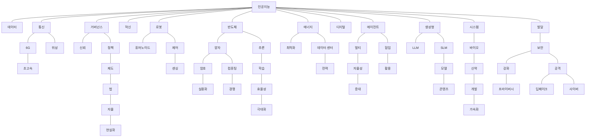
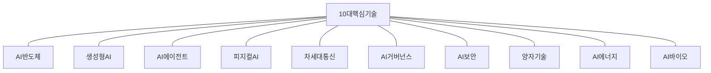
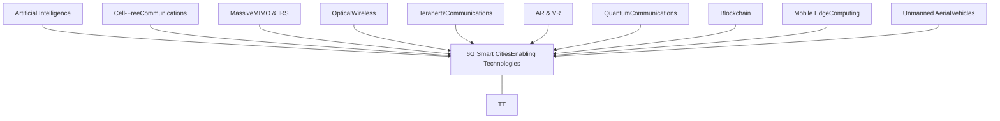
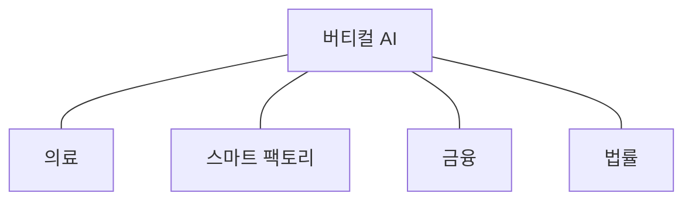

IT & FUTURE STRATEGY

# NIA가 전망한 2026년 12대 AI·디지털 트렌드

제6호 2025. 12. 31

**NIA** 한국지능정보사회진흥원

NIA가 전망한 2026년 12대 AI·디지털 트렌드 1

---

IT & FUTURE STRATEGY

# NIA가 전망한 2026년 12대 AI·디지털 트렌드

## Contents 목차

* icon: I 2026년 주요 분야 전망

* icon: II 2026년 AI·디지털 기술 분야 전망

* icon: III 2026년 AI·디지털 트렌드 전망

### IT & Future Strategy(IF Strategy) 보고서는

21세기 한국사회의 주요 패러다임 변화를 분석하고 이를 토대로 미래 지능화 시대의 주요 이슈를 전망, IT를 통한 해결방안을 모색하기 위해 한국지능정보사회진흥원(NIA)에서 기획 발간하는 보고서입니다.

### IF Strategy는

미래의 ‘만약을 대비한 전략’을 담은 보고서를 의미합니다.
NIA의 승인 없이 본 보고서의 무단전재나 복제를 금하며, 인용하실 때는 반드시 NIA, 「IT & Future Strategy 보고서」 라고 밝혀 주시기 바랍니다.
보고서 내용에 대한 문의나 제안은 아래 연락처로 해주시기 바랍니다.

illustration: robotic hand holding AI chip

illustration: robot character

**발행 :** 한국지능정보사회진흥원
**기획 :** 한국지능정보사회진흥원 인공지능정책실 미래전략팀
**조사 :** ㈜인사이트플러스
**문의 :** 한국지능정보사회진흥원 인공지능정책실 미래전략팀
배고은 선임연구원(euni@nia.or.kr)
이경석 선임연구원(2ks@nia.or.kr)

NIA 한국지능정보사회진흥원

NIA가 전망한 2026년 12대 AI·디지털 트렌드

3

---

IT & FUTURE STRATEGY

## NIA가 전망한 2026년 12대 AI·디지털 트렌드

icon: Roman numeral I

## 2026년 주요 분야 전망

### 환경분석 : 글로벌경제전망

> * IMF 등에 따르면 '26년 세계경제는 '25년 대비 성장세가 둔화될 것으로 예측
> * 주요 둔화 요인으로 美(1.7%), EU(1.2%) 등 선진국 성장 둔화, 보호무역 심화에 따르는 투자·무역 위축, 中 재정 지원 약화에 따르는 성장 동력 감소 등을 지적
> * '25년은 美 중심 AI 관련 투자 확대, 신흥 시장의 회복세 등으로 3.2%대 완만한 성장세를 기록
> * '26년은 AI 반도체 수요 확대에도 불구하고 미·중 갈등 지속, 선진국 성장 약화 등으로 둔화 전망

* 세계 주요 기관들은 2026년 글로벌 경제가 성장 둔화와 지정학적 불확실성 속에서 3%대 초반의 경제 성장세를 예측

**긍정요인**

* (AI 반도체 : 고성장) 생성형 AI 산업 활용 본격화, AI 에이전트 시스템 확산으로 AI 반도체 수요 지속

* (통신/서비스 : 안정) 클라우드 컴퓨팅, 6G 인프라, 사이버 보안 솔루션 등 인공지능 전환(AX) 서비스 안정적 성장세 전망

**부정요인**

* (무역 : 대폭 둔화) 미·중 갈등에 따른 보호무역 확산, 관세 장벽이 글로벌 교역 성장의 제약 요인으로 작용

* (제조업 : 둔화세 심화) 글로벌 수요 둔화, 높은 재고 지속을 비롯해, 관세 충격이 본격화되면서 악영향

* (기업투자 : 선별 투자) 전통산업은 수요 불확실성 등으로 위축되나, AI, 반도체 등 전략 분야는 투자 가속화

* (공급망 : 블록화 가속) 지정학적 분절화 심화로 안보를 중심으로 한 공급망 재편(Reshoring) 가속화

~~**주요 기관별 세계 경제 성장률 전망**~~ (%)

<table>
  <thead>
    <tr>
      <th>전망 시점</th>
      <th>2024</th>
      <th>2025(e)</th>
      <th>2026(e)</th>
    </tr>
  </thead>
  <tbody>
    <tr>
      <td>세계전체</td>
<td>3.3</td>
<td>3.2</td>
<td>3.1</td>
    </tr>
<tr>
      <td>선진국 2025.10</td>
<td>1.8</td>
<td>1.6</td>
<td>1.6</td>
    </tr>
<tr>
      <td>신흥국</td>
<td>4.3</td>
<td>4.2</td>
<td>4.0</td>
    </tr>
<tr>
      <td>세계전체</td>
<td>3.3</td>
<td>3.2</td>
<td>2.9</td>
    </tr>
<tr>
      <td>G20국가 2025.12</td>
<td>3.4</td>
<td>3.2</td>
<td>2.9</td>
    </tr>
<tr>
      <td>OECD국가</td>
<td>1.7</td>
<td>1.7</td>
<td>1.7</td>
    </tr>
  </tbody>
</table>

※ 출처 : IMF, World Economic Outlook('25.10), OECD, Economic Outlook('25.12)

<u>**한국은행 주요 국가별</u> 경제 성장률 전망** (%)

<table>
  <thead>
    <tr>
      <th>구분</th>
      <th>2024년(e) 연간</th>
      <th>2025년(e) 상반</th>
      <th>2025년(e) 하반</th>
      <th>2026년(e) 연간</th>
    </tr>
  </thead>
  <tbody>
    <tr>
      <td>세계</td>
<td>3.3</td>
<td>3.4</td>
<td>2.7</td>
<td>2.9</td>
    </tr>
<tr>
      <td>미국</td>
<td>2.8</td>
<td>2.1</td>
<td>1.8</td>
<td>2.1</td>
    </tr>
<tr>
      <td>유로</td>
<td>0.9</td>
<td>1.4</td>
<td>1.2</td>
<td>1.1</td>
    </tr>
<tr>
      <td>중국</td>
<td>5.0</td>
<td>5.3</td>
<td>4.6</td>
<td>4.4</td>
    </tr>
<tr>
      <td>일본</td>
<td>-0.2</td>
<td>1.9</td>
<td>0.6</td>
<td>0.5</td>
    </tr>
  </tbody>
</table>

※ 출처 : 한국은행, 경제전망보고서('25.11)

NIA가 전망한 2026년 12대 AI·디지털 트렌드

NIA가 전망한 2026년 12대 AI·디지털 트렌드 5

---

환경분석 : 국내경제전망 환경분석 : 산업전망

• 기관별 분석에 따르면, ’26년 국내 경제 성장률이 1.8%~2.1% 수준으로 회복할 것으로 전망

• ’26년 국내 경제 성장률 회복 요인으로 글로벌 반도체 경기호조, APEC 이후 불확실성 완화 및 정부의 확장재정 등이 기인

• KDI에 따르면, ’26년 국내 경제 성장률은 ’25년 0.9% 대비 0.8% 상승한 1.8%로 예측

• 상승 요인으로는 수출 부진에도 불구하고, 민간소비(1.3% → 1.6%) 개선될 전망

• 반도체 경기 호조세 유지에 따르는 설비투자의 완만한 증가 흐름(2.5%→2.0%) 유지

## ~~주요 기관별 국내 경제 성장률 전망~~

(%)

<table>
  <thead>
    <tr>
        <th>기관</th>
        <th>전망 시점</th>
        <th>2024</th>
        <th>2025</th>
        <th>2026(e)</th>
    </tr>
  </thead>
  <tbody>
    <tr>
        <td>IMF</td>
<td>2025.10</td>
<td>2.0</td>
<td>0.9</td>
<td>1.8</td>
    </tr>
<tr>
        <td>OECD</td>
<td>2025.12</td>
<td>2.0</td>
<td>1.0</td>
<td>2.1</td>
    </tr>
<tr>
        <td>KDI</td>
<td>2025.11</td>
<td>2.0</td>
<td>0.9</td>
<td>1.8</td>
    </tr>
  </tbody>
</table>

※ 출처 : IMF, World Economic Outlook(’25.10), OECD, Economic Outlook (’25.12), KDI, 경제전망(’25.11)

• 한국은행은 경제성장률을 1.0% 수준으로 제시하였으며, 4/4분기중에는 3/4분기중 큰 폭 성장에 따른 기저 효과와 관세부과 품목 중심의 수출 둔화로 성장률이 상당폭 낮아질 것으로 분석

• ’26년은 소비 회복세가 지속되고 건설 부진이 완화되면서 내수를 중심으로 성장세가 확대될 것으로 예상

• 수출은 미국 관세 영향으로 둔화되겠지만 반도체의 경우 안정적인 성장 흐름세를 보이며, 연간 성장률은 1.8% 수준으로 제시

## ~~한국은행 국내 경제 성장률 전망~~

(%)

<table>
  <thead>
    <tr>
        <th rowspan="2">구분</th>
        <th rowspan="2">2024년 연간</th>
        <th colspan="3">2025년</th>
        <th rowspan="2">2026년(e) 연간</th>
    </tr>
<tr>
        <th>상반</th>
        <th>하반(e)</th>
        <th>연간(e)</th>
    </tr>
  </thead>
  <tbody>
    <tr>
        <td>GDP</td>
<td>2.0</td>
<td>0.3</td>
<td>1.8</td>
<td>1.0</td>
<td>1.8</td>
    </tr>
<tr>
        <td>민간소비</td>
<td>1.1</td>
<td>0.7</td>
<td>1.9</td>
<td>1.3</td>
<td>1.7</td>
    </tr>
<tr>
        <td>건설투자</td>
<td>-3.3</td>
<td>-12.2</td>
<td>-5.3</td>
<td>-8.7</td>
<td>2.6</td>
    </tr>
<tr>
        <td>설비투자</td>
<td>1.7</td>
<td>4.5</td>
<td>0.8</td>
<td>2.6</td>
<td>2.0</td>
    </tr>
<tr>
        <td>상품 수출</td>
<td>6.4</td>
<td>1.7</td>
<td>4.0</td>
<td>2.9</td>
<td>1.4</td>
    </tr>
<tr>
        <td>상품 수입</td>
<td>1.3</td>
<td>1.7</td>
<td>2.9</td>
<td>2.3</td>
<td>2.4</td>
    </tr>
  </tbody>
</table>

※ 출처 : 한국은행, 경제전망보고서(’25.11)

• 기관별 분석에 따르면, 반도체, IT 및 통신, 조선 등 기술 주도 산업은 활황, 자동차 등 구조적 안정화 산업은 안정, 이차전지, 디스플레이 등 장기 부진 업황 산업은 회복으로 전망

• 구조적 공급 과잉 및 리스크 직면한 석유화학, 정유, 철강, 건설은 심각한 침체기의 가능성 존재

### 산업 전반

icon: 활황 활황 icon: 안정 안정 icon: 회복 회복 icon: 침체 침체

### ~~주요 산업 경기 사이클~~

<table>
  <thead>
    <tr>
        <th>구분</th>
        <th>KPMG</th>
        <th>신한투자증권</th>
        <th>KB증권</th>
        <th>산업연구원</th>
        <th>NH투자증권</th>
    </tr>
  </thead>
  <tbody>
    <tr>
        <td>이차전지</td>
<td>-</td>
<td>[icon: 회복]</td>
<td>[icon: 회복]</td>
<td>[icon: 회복]</td>
<td>[icon: 회복]</td>
    </tr>
<tr>
        <td>자동차</td>
<td>[icon: 안정]</td>
<td>[icon: 안정]</td>
<td>[icon: 안정]</td>
<td>[icon: 안정]</td>
<td>[icon: 안정]</td>
    </tr>
<tr>
        <td>조선</td>
<td>[icon: 활황]</td>
<td>[icon: 안정]</td>
<td>[icon: 안정]</td>
<td>[icon: 안정]</td>
<td>[icon: 안정]</td>
    </tr>
<tr>
        <td>철강</td>
<td>[icon: 침체]</td>
<td>[icon: 침체]</td>
<td>[icon: 침체]</td>
<td>[icon: 침체]</td>
<td>[icon: 침체]</td>
    </tr>
<tr>
        <td>정유</td>
<td>[icon: 침체]</td>
<td>[icon: 침체]</td>
<td>[icon: 활황]</td>
<td>[icon: 침체]</td>
<td>[icon: 침체]</td>
    </tr>
<tr>
        <td>석유 화학</td>
<td>[icon: 침체]</td>
<td>[icon: 침체]</td>
<td>[icon: 침체]</td>
<td>-</td>
<td></td>
    </tr>
<tr>
        <td>반도체</td>
<td>[icon: 활황]</td>
<td>[icon: 활황]</td>
<td>[icon: 활황]</td>
<td>[icon: 활황]</td>
<td>[icon: 활황]</td>
    </tr>
<tr>
        <td>디스플레이</td>
<td>-</td>
<td>-</td>
<td>-</td>
<td>-</td>
<td>-</td>
    </tr>
<tr>
        <td>건설</td>
<td>-</td>
<td>-</td>
<td>-</td>
<td>-</td>
<td>-</td>
    </tr>
<tr>
        <td>IT 및 통신</td>
<td>[icon: 활황]</td>
<td>[icon: 활황]</td>
<td>[icon: 활황]</td>
<td>[icon: 활황]</td>
<td>[icon: 활황]</td>
    </tr>
  </tbody>
</table>

<table>
  <thead>
    <tr>
        <th>구분</th>
        <th colspan="2">주요 내용</th>
    </tr>
  </thead>
  <tbody>
    <tr>
        <td rowspan="2">[icon: 활황] 활황</td>
<td>반도체</td>
<td>• AI 서버 및 엣지 컴퓨팅 수요 폭발에 따른 고대역폭 메모리 및 파운드리 시장의 압도적 성장 지속, 반도체 사이클의 고점 진입 예상</td>
    </tr>
<tr>
        <td>IT 및 통신</td>
<td>• AI 서비스 및 플랫폼 확산, 데이터센터 투자 확대, 6G 상용화 준비 등으로 인프라 및 서비스 수요 동반 성장</td>
    </tr>
<tr>
        <td>[icon: 안정] 안정</td>
<td>자동차</td>
<td>• 글로벌 수요 둔화 우려에도 불구하고 하이브리드 및 프리미엄 부문 판매 호조가 전체 실적을 방어하며 안정적 성장 유지</td>
    </tr>
<tr>
        <td rowspan="2">[icon: 회복] 회복</td>
<td>디스플레이</td>
<td>• IT 기기(태블릿, 노트북)의 OLED 채택 증가 및 중소형 OLED 수요 개선에 힘입어 전반적인 업황 회복, 다만, 대형 패널 시장의 경쟁 심화는 부담 요인</td>
    </tr>
<tr>
        <td>이차전지</td>
<td>• EV 성장 둔화라는 단기적 난관에도 불구하고, ESS시장의 폭발적인 성장과 북미·유럽 중심의 정책적 수혜에 힘입어 업황이 바닥을 다지고 회복 국면에 진입할 것으로 예상</td>
    </tr>
<tr>
        <td rowspan="3">[icon: 침체] 침체</td>
<td>정유</td>
<td>• 글로벌 정제 마진 약세로의 전환 예상, 지정학적 리스크 완화 시 유가 하락 및 수요 둔화 우려로 이익률 감소 압박이 커지며 침체 국면 진입 위험</td>
    </tr>
<tr>
        <td>석유화학</td>
<td>• 중국발(發) 대규모 공급 과잉 지속 및 수요 회복 지연으로 인한 스프레드(마진) 축소 심화, 범용 제품을 중심으로 한 심각한 업황 부진이 지속될 전망</td>
    </tr>
<tr>
        <td>건설</td>
<td>• 고금리 장기화에 따른 부동산 PF(프로젝트 파이낸싱) 리스크와 주택 착공 물량 급감의 영향이 2026년에 가장 심각하게 반영되며 침체 지속</td>
    </tr>
  </tbody>
</table>

6 한국지능정보사회진흥원 NIA가 전망한 2026년 12대 AI·디지털 트렌드 7

---

### 환경분석 : 사회전망

## 2026년은 AI가 스스로 판단하고 행동하는 에이전틱(Agentic) AI 시대로 진입하며, 사회는 초개인화, 초연결, 초지능을 중심으로 재편이 시작될 전망 Q

AI가 개인의 대리인이자 동반자로서 삶의 질을 관리하는 형태로 진화할 전망
핵심 Keyword : Agentic AI, 정서적 AI, 웰니스, 디지털 정체성

### AI 에이전트, 핵심 파트너로 진화

연계기술 : 온디바이스 AI, LAM(대형 행동 모델)

AI 에이전트가 개인의 니즈에 맞춰, 쇼핑, 일정 관리뿐 아니라 금융 리스크 관리, 업무의사결정 등 핵심 영역의 실질적인 파트너 역할을 수행할 전망

### 초정밀 예방 의료의 본격화

연계기술 : AI 바이오, 디지털트윈

웨어러블 기기가 수집한 생체 데이터를 AI가 실시간 분석하여 질병을 예측하고, 보험 및 식단까지 제안하는 ‘데이터 기반 건강관리’가 일상화

### 정서적 교감과 디지털 동반자

연계기술 : 멀티모달 AI, 감성 컴퓨팅

1인 가구 증가와 고령화에 대응하여, 사용자의 감정 상태를 음성·표정으로 읽고 위로하거나 대화하는 ‘반려 AI’ 서비스가 확산

### 디지털 페르소나와 인증

연계기술 : 블록체인 DID, 워터마킹

딥페이크 등의 위협에 대응하여, ‘진짜 나’와 ‘디지털 공간의 나’를 증명하고 보호하는 블록체인 기반의 신원 인증(DID)이 필수적인 사회 규범으로 자리 잡을 전망

AI를 사용하는 단계를 넘어, AI와 인간이 한 팀으로 일하는 ‘AI-Human 협업’ 구조로 전환
핵심 Keyword : AI 코워커, AI 스킬 기반 조직, AI 자동화, 알고리즘 경영

### AI 동료와의 협업

연계기술 : LLM(대형 언어 모델) 기반 솔루션

단순 반복 업무는 AI 에이전트에 위임하고, 인간은 창의적 의사결정과 AI 결과물을 검수하는 역할로 업무 분장이 명확해지면서, ‘1인 1 AI 비서’가 보편화될 전망

### 초지능 산업화의 시대

연계기술 : 버티컬 AI, 특화 LLM

AI가 금융, 제조, 헬스케어 등 핵심산업의 의사결정 파트너가 되는 초지능 산업화가 본격화되면서, 기업들은 AI 네이티브 플랫폼 & AI 슈퍼컴퓨팅 플랫폼을 통한 혁신의 속도를 높일 전망

### AI 거버넌스와 윤리경영

연계기술 : AI 보안, 설명 가능한 AI(XAI)

기업 내 AI 도입의 확대로 AI의 편향성, 저작권, 보안 문제에 대한 AI 윤리 책임이 중요해지고 거버넌스 관련 규제가 비즈니스의 핵심 변수가 될 전망

### 초국경 업무 환경 확대

연계기술 : HR 테크, AI 기반 역량 분석 플랫폼

학위나 직무 타이틀보다, 급변하는 AI 툴을 다루고 적응하는 스킬(Skill) 단위로 인재를 평가하고 채용하는 경향이 뚜렷해 질 전망

<table>
  <thead>
    <tr>
        <th>구분</th>
        <th>내용</th>
    </tr>
  </thead>
  <tbody>
    <tr>
        <td>에이전틱 (Agentic) AI 시대</td>
<td>초개인화된 생활</td>
    </tr>
<tr>
        <td>에이전틱 (Agentic) AI 시대</td>
<td>초지능화된 생태계</td>
    </tr>
<tr>
        <td>에이전틱 (Agentic) AI 시대</td>
<td>초연결 리얼리티</td>
    </tr>
  </tbody>
</table>

### 공간컴퓨팅의 일상화

연계기술 : XR, 6G 네트워크

AR(증강현실) 글래스 등 XR(확장현실) 기기를 통해 물리적 현실 위에 디지털 정보가 현실이 되는 경험 대중화

### 자율협력 운영 체계로의 전환

연계기술 : 협동로봇, 피지컬 AI

사람, 로봇, AI 시스템이 하나의 운영 체계로 연결되면서, 실시간으로 목표를 공유하고 실행을 협력적으로 조율하며 운영 효율을 극대화

### 자율주행과 공간의 확장

연계기술 : SDV(소프트웨어 중심 자동차)

완전 자율주행(레벨 3~4) 기술의 고도화로 자동차가 단순 이동 수단이 아닌, 업무나 휴식을 취하는 ‘제3의 생활 공간’으로 정의

### 지능형 친환경 도시

연계기술 : AIoT, AI 에너지 관리

기후 위기에 대응하여 AI가 건물과 도시의 에너지 효율을 최적화하고, 탄소 배출을 모니터링하는 ‘지능형 친환경 도시’ 인프라가 구축

물리적 공간 위에 디지털 정보가 융합하는 ‘피지털(Physical + Digital)’의 전환이 가속화되면서, 공간은 더 이상 고정되지 않고 사용자에 따라 유동적으로 변화
핵심 Keyword : 공간컴퓨팅, 몰입형 경험, 스마트시티, 지속 가능성

8

한국지능정보사회진흥원

NIA가 전망한 2026년 12대 AIㆍ디지털 트렌드

9

---

## 환경분석 : 주요국 정책기조

2026년 美·中·EU 모두 기술 주도권 확보와 경제적 독립을 최우선 목표로 글로벌 경쟁과 내수 강화를 동시에 추구하는 정책을 추진할 전망
미국: 보호무역 및 규제완화를 통한 기업 주도 혁신, 중국: 국가 주도 기술 자강 및 내수 확대, 유럽연합(EU): 전략적 투자를 통한 기술 주권 확보에 집중

~~**글로벌 주요국의 정책기조**~~

<table>
  <thead>
    <tr>
        <th>구분</th>
        <th>logo: 미국 미국</th>
        <th>logo: 중국 중국</th>
        <th>logo: 유럽연합(EU) 유럽연합(EU)</th>
    </tr>
  </thead>
  <tbody>
    <tr>
        <td>정책핵심기조</td>
<td>• 미국 우선주의(America First) 강화 • 기술 주권(Technology Sovereignty) 확보 • 대규모 AI 인프라 투자 및 반도체 공급망 자립 강화</td>
<td>• 고품질 발전 전환 및 과학기술 자립 자강 심화 • 안보와 발전의 균형 강조 • 제15차 5개년 계획(2026~2030), 산업·기술 체계 재편</td>
<td>• 유럽 주권(Sovereignty) 및 전략적 자율성 확보 • AI Act 등 규제 선도를 통한 글로벌 표준 설정 • 방위비 중심 재정 확대 및 역내 경쟁력 강화</td>
    </tr>
<tr>
        <td>경제 및 무역</td>
<td>• 보호무역주의 회귀 및 관세 영향 본격화 • 자국 우선주의 정책으로 글로벌 무역 둔화 가능성 • 핵심 품목 공급망 안정화를 위한 산업 간 협력 강화</td>
<td>• 내수 진작 및 산업구조 고도화로 전환 시도 • 수출 견조세를 위해 반도체, 전기차 등 고부가 품목 육성 • 소비 부진 극복을 위한 내수 부양 노력 지속</td>
<td>• 단일 시장 경쟁력 강화 및 규제 간소화 • 방위비 중심의 재정 확대 기조 • 무역 정책을 통한 전략 기술 보호</td>
    </tr>
<tr>
        <td>AI 및 과학기술</td>
<td>• AI 인프라 확충을 목표로 ‘스타게이트 프로젝트’ 추진 • 데이터센터, 반도체 생산, 에너지 인프라 등에 집중 투자 • AI 패권의 물리적·기술적 기반 동시 구축 강화</td>
<td>• 첨단산업 육성 기조를 이어가며 ‘AI+’ 이니셔티브 추진 • 과학기술 혁신을 통한 신질(新質) 생산력 발전 강조 • 양자, 바이오, 수소, 6G 등 미래 동력 육성·기술 자립 최우선</td>
<td>• 유럽 주도 AI 생태계 구축을 위한 10억 유로 규모 자금 투자 • AI 팩토리 및 기가 팩토리 배치 계획(~2026년) • 데이터, 사이버보안, 우주 등 핵심 기술 분야 리더십 확보 추진</td>
    </tr>
<tr>
        <td>R&#x26;D</td>
<td>• ‘CHIPS and Science Act’로 미국 연방 연구기관(NSF, DOE, NIST) 지원 확대를 통한 반도체, 바이오, 양자 등 전략 기술 집중 투자</td>
<td>• 기초 연구 및 응용 기술 분야에 정부 예산 집중 투입 • 핵심 기술 자립 목표 달성을 위한 연구 인프라 확대</td>
<td>• 단일시장·혁신·디지털 부문에 대한 예산(220.2억 유로) 배정 • 특히 연구·혁신 분야에 140.12억 유로 편성</td>
    </tr>
<tr>
        <td>기술규제</td>
<td>• AI 칩을 포함한 첨단 기술을 국가안보 자산으로 규정, 수출 통제 품목 확대 • 제3국 재수출까지 통제 규제 범위 확장을 통한 공급망 전반에 대한 통제력 강화</td>
<td>• AI 거버넌스 개선 및 디지털/지능형 기술 혁신 가속화 병행 • 안보/체제 안전을 최우선으로 사이버, 데이터, AI 등 신흥 분야 역량 강화 요구</td>
<td>• 세계 최초의 포괄적 AI 규제 법안인 EU AI 법 시행 • 위험 기반 접근을 통해 규제를 선도하고 혁신을 병행 추구 • 2025.11 디지털 간소화 방안 발표(AI 규제 일부 완화) • 디지털 공정법(Digital Markets Act) 등을 통한 시장 건전성 확보</td>
    </tr>
<tr>
        <td>기후</td>
<td>• 환경규제 완화를 통한 화석연료 중심 정책 전환 추진 • 파리협정 탈퇴와 130억 달러 규모의 청정에너지 관련 지원 계획 철회</td>
<td>• 고품질 성장 기조 하에 탄소 중립 달성을 위한 로드맵 준수 • 녹색 산업 발전 및 에너지 구조 조정 지속</td>
<td>• 기후 중립 대륙을 목표로 하는 녹색 전환 지속 • 산업 전략을 통해 기후 중립 전환을 주도할 유럽 산업 육성</td>
    </tr>
<tr>
        <td>공공 및 행정</td>
<td>• 정부 서비스의 디지털 전환 가속화 및 사이버 보안 강화 • 공공 부문 AI 활용 확산 방안 모색</td>
<td>• 디지털 전환을 통한 정부 효율성 제고 및 관리 시스템 고도화 • 도시/농촌 디지털 인프라 격차 해소 노력</td>
<td>• 2026년 말까지 모든 유럽인이 안전한 디지털 신분을 갖는 유럽 디지털 신원 지갑(Digital Identity Wallet) 도입 목표 • 디지털 공공 서비스 품질 향상 목표 설정</td>
    </tr>
  </tbody>
</table>

\* 출처 : 미국, The President’s FY 2026 Discretionary Budget Request(’25.7), NIA The LENS 시리즈(’25) / 중국, CPC plenum concludes, adopting recommendations for China’s 15th Five-Year Plan(’25.10) / EU, commission work programme 2026(’25.10), IMF, WB, 각국 중앙은행의 인플레이션 전망 및 통화 정책 방향 보고서 등

10 한국지능정보사회진흥원 NIA가 전망한 2026년 12대 AI·디지털 트렌드11 11

---

**<u>참고</u>** logo: NIA 글로벌 주요 이슈

## 지정학적 분절화 심화 및 신(新) 보호무역주의 확산 I
* 미·중 간 패권경쟁, 러시아-우크라이나 전쟁, 중동 갈등 등으로 인해 세계 경제 질서가 블록화되고, 국가 간 상호 의존도가 약화되며 보호무역 장벽이 높아지는 현상이 심화될 전망

* 보호무역주의의 확산으로, 글로벌 공급망 재편 및 단절 가속화, 방위산업 등 안보 리스크 산업이 성장할 것으로 예측

* 미국, 유럽연합 등 주요국에 대한 맞춤형 통상 전략 마련이 필요하며, 수출 기업 지원을 위한 예산 확대 방안 및 주요 기술 선도국과의 AI·반도체 전략적 R&D 및 인적 교류 확대 모색이 필요

## AI 중심의 기술적 ‘재창조(Reinvention)’와 산업 구조 전면 개편 대응 II
* AI 에이전트, 범용인공지능, 초지능이 산업 전반에 본격 투입되어 단순 자동화를 넘어, 금융, 제조, 헬스케어 등 비즈니스 모델과 의사결정 구조 자체를 재편하는 시대가 도래할 전망

* 산업 구조의 재편에 따라, AI를 활용한 예방적 사이버 보안, 디지털 콘텐츠의 진위 검증 기술의 중요성이 증대

* AI의 전면적 도입을 위해 첨단 GPU 확보 물량 확대 및 국가 AI 컴퓨팅 센터 구축 등 공공 인프라 투자 대폭 확대 필요하며, 제조, 의료, 공공서비스 등에 AI를 적용하는 ‘AI 대전환 프로젝트’ 추진 모색 및 글로벌 인재 확보를 위한 AI 인재 양성 프로그램 확대 등 다분야의 제도적·조직적 대응방안 마련이 필요

## 글로벌 저성장 기조 고착화 III
* 세계 경제가 3%대 초반의 낮은 성장률에 머무르며 저성장이 구조적으로 고착화될 위험 및 미국의 통상 압력과 지정학적 갈등으로 인해 투자 불확실성이 극대화될 전망

* 글로벌 환경에 대응하기 위해 AI 신기술 확보, 신흥 시장 개척, 자원 외교 강화 등 새로운 성장 동력 확보를 위한 국가적 전략 대응 마련이 필수

* 첨단소재, 부품 등 초혁신경제 신산업 프로젝트에 대한 R&D 예산 확대 모색 및 AI 및 기후변화 등 미래 성장 축에 재정 집중 투입 강구 등 선제적 대응이 필요
## AI발(發) 노동시장의 대격변과 양극화 심화 IV
* AI 에이전트의 확산으로, 화이트칼라 지식 노동 영역에서 대규모 노동 대체가 현실화되는 한편, AI를 활용하는 소수집단에 대한 생산성·소득 증가 전망

* 각국은 AI 리터러시 교육 의무화, 로봇세금 등 AI 사용에 대한 세금 부과 논의, 보편적 기본소득에 대한 논의가 확대될 것으로 예상

* AI 기술 도입으로 인한 구조적 실업 문제에 대비하기 위해 신기술 분야 직업 훈련 및 전직 지원 프로그램 강화를 모색하고, 전국민을 대상으로 하는 AI·디지털 역량 강화 교육 실시 및 AI 시대에 맞는 사회 안전망 재설계와 소외 계층을 위한 디지털 접근성 보장 정책 등을 강구

## 기후 변화에 따르는 환경 자원의 무기화 가속 V
* 기후 변화 위협이 더욱 명확해지는 ‘티핑 포인트(Tipping Point)’에 근접, 친환경 에너지 핵심자원 및 전략 자원(희토류 원소 등) 확보 경쟁이 심화 전망

* 전략 자원 확보를 위해 각국의 환경 규제와 탄소 국경조정제도 등 무역 정책 연계 강화 등 외교·기술적 경쟁 심화가 예상

* AI 기반 기후 재난 예측 시스템 및 환경 모델링 고도화 정책을 수립하고 AI 기반 핵심 광물 순환 시스템 및 재자원화 효율 극대화를 위한 AI 로봇 및 스마트 공정 개발 지원 등 탄소 국경조정제도 대응 차원에서 AI 기반 탄소 저감 및 에너지 효율 최적화 시스템 구축 방안 마련이 필요

12 한국지능정보사회진흥원

NIA가 전망한 2026년 12대 AI·디지털 트렌드 13

---

logo: 참고

## 기반기술 분야 분석

AI 지능화, 빅데이터 처리 능력 향상, 초연결 인프라(6G/데이터센터)의 통합으로 모든 산업의 자율 전환이 가속될 전망

### 통신서비스

AI를 핵심요소로 내재화한 AI-Native 네트워크와 초소형 위성통신 통합으로 AI 데이터센터 연결을 가속화하며, **디지털 융합 산업의 지능적 혁신을 주도할 전망**

* 6G 구축은 테라 헤르츠 장비와 RIS 안테나 등 첨단 네트워크 장비 외에도, AI-Native 구현을 위한 엣지 AI 칩셋/GPU·초소형 위성 등 초지능 인프라 수요를 급증시킬 전망

* 6G 기술은 AI-Native 네트워크와 초저지연/초신뢰 특성을 기반으로, 지능형 메타버스와 NTN 연동을 통한 전 영역 초실감/초정밀 서비스(예 : 원격 조종, 디지털 트윈) 구현을 실현할 것으로 기대

#### 글로벌 6G 시장 전망 (단위 : 십억 달러)

<table>
  <thead>
    <tr>
        <th>Year</th>
        <th>Market Size (Billion USD)</th>
    </tr>
  </thead>
  <tbody>
    <tr>
        <td>2025</td>
<td>8.30</td>
    </tr>
<tr>
        <td>2026</td>
<td>10.30</td>
    </tr>
<tr>
        <td>2027</td>
<td>12.77</td>
    </tr>
<tr>
        <td>2028</td>
<td>15.83</td>
    </tr>
<tr>
        <td>2029</td>
<td>19.63</td>
    </tr>
<tr>
        <td>2030</td>
<td>24.34</td>
    </tr>
<tr>
        <td>2031</td>
<td>30.18</td>
    </tr>
<tr>
        <td>2032</td>
<td>37.43</td>
    </tr>
<tr>
        <td>2033</td>
<td>46.41</td>
    </tr>
<tr>
        <td>2034</td>
<td>57.55</td>
    </tr>
  </tbody>
</table>

연평균 성장률 : 24.0%
\* 출처 : Precedence research (’25)

### 빅데이터

디지털화에 따른 데이터 양의 기하급수적 증가와 함께, 생성형 AI 활용이 기업의 핵심 전략으로 자리 잡으면서 **BDaaS 시장은 초고속 성장을 지속할 전망**

* 빅데이터 기술은 생성형 AI 에이전트 시스템에 통합되어 자율적인 의사결정 수준을 높이며, 공급망, 고객 경험, 리스크 예측 등 전 비즈니스 프로세스의 자율적 재설계를 가속화할 전망

* 정부와 산업계의 AI 인프라 구축 투자 증가, 클라우드 기반의 BDaaS(Big Data as a Service) 확산, 그리고 6G·IoT 인프라 고도화에 따른 데이터 생성량 폭증에 의해 강력하게 견인될 전망

#### 글로벌 BDaaS(Big Data as a Service) 시장 전망 (단위 : 십억달러)

<table>
  <thead>
    <tr>
        <th>Year</th>
        <th>Market Size (Billion USD)</th>
    </tr>
  </thead>
  <tbody>
    <tr>
        <td>2025</td>
<td>41.55</td>
    </tr>
<tr>
        <td>2030</td>
<td>147.71</td>
    </tr>
  </tbody>
</table>

연평균 성장률 : 27.81%
\* 출처 : Mordor Intelligence (’25)

### 데이터 센터

디지털 혁신 지속과 생성형 AI 모델 학습 및 AI 슈퍼컴퓨팅 플랫폼 구축 경쟁이 **데이터센터 수요를 폭발적으로 증가시킬 전망**

* 데이터센터 수요는 생성형 AI 고도화와 6G 발전으로 급증하며, 대규모 AI 데이터센터의 초집적화와 AI 내장 엣지 컴퓨팅의 확산으로 인프라의 지능화가 가속화될 전망

* 기업과 정부의 탄소 중립 목표로 인해 그린 데이터센터 투자가 급증하며, 특히 AI 데이터센터의 전력 폭증에 대응하여 초고효율 기술을 통한 PUE(전력효율지수) 개선이 필수적인 전략으로 자리 잡을 전망

#### 글로벌 데이터 센터 시장 전망 (단위 : 십억 달러)

<table>
  <thead>
    <tr>
        <th>Year</th>
        <th>Market Size (Billion USD)</th>
    </tr>
  </thead>
  <tbody>
    <tr>
        <td>2024</td>
<td>242.72</td>
    </tr>
<tr>
        <td>2025</td>
<td>269.79</td>
    </tr>
<tr>
        <td>2026</td>
<td>302.30</td>
    </tr>
<tr>
        <td>2027</td>
<td>337.36</td>
    </tr>
<tr>
        <td>2028</td>
<td>376.50</td>
    </tr>
<tr>
        <td>2029</td>
<td>420.17</td>
    </tr>
<tr>
        <td>2030</td>
<td>468.91</td>
    </tr>
<tr>
        <td>2031</td>
<td>523.31</td>
    </tr>
<tr>
        <td>2032</td>
<td>584.86</td>
    </tr>
  </tbody>
</table>

연평균 성장률 : 11.7%
\* 출처 : Fortune Business Insights (’25)

### 인공지능

AI 모델의 경량화 기술 발전 경쟁이 심화되며, **데이터 기반의 자동화된 지능을 실현하는 핵심 기술로서 시장 성장을 주도**

* 운영 효율화, 고객 경험 향상, 데이터 기반 의사 결정을 지원하는 더욱 지능적인 시스템에 대한 필요성으로 인해 다양한 산업 분야에서 AI 솔루션에 대한 수요가 증가

* AI 기술 발전을 통해 기업 운영 패러다임이 ‘인간 지원’에서 ‘자율적 시스템 운영’으로 전환되며, AI가 스스로 의사결정하고 실행하는 에이전트 중심의 지능화가 산업 전반의 핵심 기반으로 자리매김할 전망

#### 글로벌 인공지능 시장 전망 (단위 : 십억 달러)

<table>
  <thead>
    <tr>
        <th>Year</th>
        <th>Market Size (Billion USD)</th>
    </tr>
  </thead>
  <tbody>
    <tr>
        <td>2024</td>
<td>391.7</td>
    </tr>
<tr>
        <td>2025</td>
<td>542.5</td>
    </tr>
<tr>
        <td>2026</td>
<td>751.4</td>
    </tr>
<tr>
        <td>2027</td>
<td>1,040.6</td>
    </tr>
<tr>
        <td>2028</td>
<td>1,441.3</td>
    </tr>
<tr>
        <td>2029</td>
<td>1,996.2</td>
    </tr>
<tr>
        <td>2030</td>
<td>2,764.7</td>
    </tr>
<tr>
        <td>2031</td>
<td>3,829.1</td>
    </tr>
<tr>
        <td>2032</td>
<td>5,303.4</td>
    </tr>
<tr>
        <td>2033</td>
<td>7,345.2</td>
    </tr>
<tr>
        <td>2034</td>
<td>10,173.1</td>
    </tr>
  </tbody>
</table>

연평균 성장률 : 38.50%
\* 출처 : Market.us (’25)

14 한국지능정보사회진흥원 NIA가 전망한 2026년 12대 AIㆍ디지털 트렌드 15

---

logo: NIA 참고

## 응용기술 분야 분석

AI 에이전트와 온디바이스 AI의 결합으로, 생성형 AI가 개인·기업 워크플로우에 자율적으로 작동하며 지능을 내재화하는 시대로 산업의 패러다임이 전환

## 디바이스

### AI 반도체

빅테크의 AI 인프라 투자 폭증으로 AI 반도체 수출은 급증하나, 미-중 규제 심화와 중국의 자립화 경쟁으로 공급망 리스크 고조

* ’25년 AI 반도체 시장은 945억 달러에서 ’34년 9,313억 달러로 성장할 것으로 예상되며, 연평균 성장률은 28.94%로 전망

### AI 자율주행

AI 자율주행 시장은 폭발적인 성장세를 보이며, 단순한 자동차 산업을 넘어 모빌리티 서비스 플랫폼으로 진화

* ’25년 약 2,738억 달러 규모에서 ’34년 약 44,504억 달러 규모로 연평균 36.3% 성장 예측

* 특히 로보택시 분야는 연평균 91.8%의 성장률로 예측

### 온디바이스 AI

정체되었던 스마트폰 시장이 생성형 AI를 탑재한 차세대 스마트폰 및 AI PC의 등장으로 고속 성장 단계에 재진입

* 소비자가 생성형 AI의 가치를 수용하는 지가 시장 성장의 핵심 변수이며, 하이브리드 AI 아키텍처 구축이 필수

### 휴머노이드

VLA(시각-언어-행동) 모델을 기반으로 자율성을 확보하며, 빅테크가 주도하는 상용화 시대에 본격적으로 진입

* 2025년을 기점으로 테슬라, 엔비디아, 오픈AI 등이 대규모 투자로 상용화를 주도

* 하드웨어 부품 단가 하락이 시장 성장 속도를 좌우할 핵심 요소로 지목

AI 반도체 시장규모 및 전망 (단위 : 십억 달러)

<table>
  <thead>
    <tr>
        <th>연도</th>
        <th>시장규모</th>
    </tr>
  </thead>
  <tbody>
    <tr>
        <td>2025</td>
<td>94.53</td>
    </tr>
<tr>
        <td>2026</td>
<td>121.89</td>
    </tr>
<tr>
        <td>2027</td>
<td>157.17</td>
    </tr>
<tr>
        <td>2028</td>
<td>202.65</td>
    </tr>
<tr>
        <td>2029</td>
<td>261.30</td>
    </tr>
<tr>
        <td>2030</td>
<td>336.92</td>
    </tr>
<tr>
        <td>2031</td>
<td>434.42</td>
    </tr>
<tr>
        <td>2032</td>
<td>560.14</td>
    </tr>
<tr>
        <td>2033</td>
<td>722.24</td>
    </tr>
<tr>
        <td>2034</td>
<td>931.26</td>
    </tr>
  </tbody>
</table>

\* 출처 : precedence research (’25)
연평균 성장률 : 28.94%

웨이모 AI 자율주행 ‘로보택시(Robotaxi)’

photograph: Waymo robotaxi

\* 출처 : Waymo (’25)

온디바이스 AI 시장 규모 추정치 (단위 : 십억 달러)

<table>
  <thead>
    <tr>
        <th>연도</th>
        <th>시장규모</th>
    </tr>
  </thead>
  <tbody>
    <tr>
        <td>2023</td>
<td>16.6</td>
    </tr>
<tr>
        <td>2031</td>
<td>118.1</td>
    </tr>
  </tbody>
</table>

\* 출처 : Deloitte (’25)
연평균 성장률 : 27.9%

테슬라 휴머노이드 ‘옵티머스(Optimus)’

photograph: Tesla Optimus humanoid robot

\* 출처 : Tesla (’25)

## 서비스, SW, 콘텐츠

### AI 데이터센터

AI 데이터센터는 현대 경제의 새로운 생산 수단으로 부상했으며, GPU 기반의 고밀도 인프라로 진화하며 중장기적으로 대규모 시장으로의 성장이 예상

* 빅테크 주도의 AI 모델 개발 경쟁이 심화됨에 따라 고성능 연산을 지원할 수 있는 AI 데이터센터 수요가 폭발적으로 증가하는 추세

* 고성능 GPU, 액체 냉각, 전력/송전망 등 후방산업 전반의 대규모 투자를 견인하며 전통 밸류체인에 구조적 변화

* 데이터 주권 확보를 위한 국가적 차원의 인프라 전략이 중요

### AI 에이전트

AI 에이전트는 AI 산업 성장을 주도할 가장 중요한 전략 기술 트렌드로 급부상하며, 단순 응답을 넘어 자율적으로 복잡한 업무를 수행하는 단계로 진화

* 단순히 명령을 수행하는 것을 넘어, 자율적으로 목표를 추론하고 복잡한 다단계 작업 흐름을 계획 및 실행 하는 것이 특징

* 빅테크의 범용 에이전트 주도와 더불어, 멀티 에이전트 시스템이 새로운 축으로 빠르게 형성되고 있는 상황

* ’25년 76억 달러에서 ’33년 1,391억 달러로 성장 전망

### 양자 컴퓨팅

양자 컴퓨팅 기술은 클라우드 기반의 QCaaS모델을 통해 하드웨어 직접 보유하지 않는 방식으로 산업계에 도입이 확산되고 있는 상황

* 양자 컴퓨터가 기존 암호체계를 해독하는 시대(Q-Day)에 대비하는 양자 내성 암호(PQC) 기술 전환이 국가적 최우선 과제로 부상

* 또한, 양자 내성 암호(PQC) 전환을 위한 최고 수준의 보안 암호키인 양자난수발생기(QRNG)가 핵심 기술로 자리매김할 전망

### 생성형 AI

생성형 AI 기술은 자연어 명령만으로 캐릭터의 일관성을 유지하며 콘텐츠 제작 현장에 빠르게 상용화되고 있는 상황

* 향상된 추론 능력과 실시간 정보를 더해 더욱 정확하고 맥락 있는 시각 자료를 제공

AI 데이터 센터 시장 규모 및 전망 (단위 : 십억 달러)

<table>
  <thead>
    <tr>
        <th>연도</th>
        <th>시장규모</th>
    </tr>
  </thead>
  <tbody>
    <tr>
        <td>2025</td>
<td>17.73</td>
    </tr>
<tr>
        <td>2032</td>
<td>93.60</td>
    </tr>
  </tbody>
</table>

\* 출처 : Fortune Business Insights (’25)
연평균 성장률 : 26.83%

구글 AI 에이전트 ‘제미나이(Gemini)’

photograph: Google Gemini AI agent

\* 출처 : Google (’25)

양자 컴퓨팅 시장규모 및 전망 (단위 : 십억 달러)

<table>
  <thead>
    <tr>
        <th>연도</th>
        <th>시장규모</th>
    </tr>
  </thead>
  <tbody>
    <tr>
        <td>2024</td>
<td>21.89</td>
    </tr>
<tr>
        <td>2035</td>
<td>291.82</td>
    </tr>
  </tbody>
</table>

\* 출처 : Spherical Insights (’25)
연평균 성장률 : 26.55%

구글 생성형 AI ‘나노 바나나(Nano Banana)’

photograph: Google Nano Banana generative AI examples

\* 출처 : Google (’25)

16 한국지능정보사회진흥원 NIA가 전망한 2026년 12대 AIㆍ디지털 트렌드 17

---

IT & FUTURE STRATEGY

## NIA가 전망한

## 2026년 12대 AI·디지털 트렌드

icon: pause

# 2026년
# AI·디지털 기술 분야 전망

## AI·디지털 기술 및 트렌드 도출 프로세스

### 1 주요 기관 전망자료 수집

**트렌드 도서**

* 트렌드 코리아 2026

* 2026 트렌드 모니터

* 2026 트렌드 노트

**공공연구원/기관**

* UNCTAD

* KISTEP

* WEF

* IITP

* KIAT

* KISTI

* SPRi

* Stanford HAI

* MIT

* KITA

* IEEE

* ESPAS

**정부**

* 백악관

**총 50개 전망보고서**

**컨설팅 기업**

* McKinsey

* Deloitte

* KPMG

* IDC

* Accenture

* Capgemini

* EY

* Synechron

* LTIMindtree

* Nagarro

* The ECM Consultant

* Future Today Strategy Group

**민간연구원/기업**

* StratUsInsights

* Simplilearn

* Silverchair & Hum

* Notch

* J.P. Morgan

* info-Tech Research

* INC·IMD

* IFF·Gartner

* Forbes·Comcast

* Clifford Chance·CES

* Cambridge Open Academy

* Bankinter

* Adobe

### 2 분석용 데이터 전처리

텍스트 정제, 표제어 처리, 정규화 및 사전 매핑

icon: arrow right

### 3 AI·디지털 트렌드 데이터셋 산출

illustration: word cloud with the word 'corpus' centered

### 4 텍스트 네트워크 분석

단어의 빈도 및 연관성 정도를 분석하여 연관성이 높은 단어를 추출, 연결

icon: arrow right

### 5 핵심기술 도출

단어의 연결성을 고려하여 총 10개의 핵심 기술 도출

### 6 토픽모델링 분석

보고서 내용을 유형화하여 주제 도출

icon: arrow right

### 7 AI·디지털 트렌드 도출

기술 간 융합 포인트를 고려해 20개의 AI·디지털 트렌드 도출

icon: arrow right

### 8 트렌드 구체화

전문가 자문, 최근 이슈 등을 반영해 전망부분 구체화

NIA가 전망한 2026년 12대 AI·디지털 트렌드

19

---

## 텍스트 네트워크 분석
## 핵심기술 도출

* 

 **텍스트 네트워크**: 전망자료에 등장한 키워드들을 중심으로 단어의 빈도 및 연관성의 정도를 분석하여 연관성이 높은 단어들을 추출, 연결하였음
* 

 **핵심기술 도출**: 텍스트 네트워크 분석을 기반으로 키워드의 연결성을 고려하여 총 10개의 핵심기술을 도출

icon: search

### 10대 핵심기술

* 

 **생성형 AI**: LLM과 SLM의 분화를 통해 콘텐츠 생성, 자동화 협업을 보편화시키는 인공지능 인프라
* 

 **피지컬 AI**: 로봇 파운데이션 모델을 기반으로 물리적 세계에서 자율적 인지 및 행동을 구현하는 기술
* 

 **AI 거버넌스**: AI 법/규제 프레임워크를 통해 AI의 윤리성, 안전성, 책임성을 확보하려는 제도적 노력
* 

 **AI 바이오**: AI로 신약 개발 과정과 정밀 의료를 가속화하여 바이오 R&D 효율을 혁신
* 

 **차세대 통신**: 6G와 NTN(위성 통합망)을 통해 지상 한계를 넘어선 초고속, 초연결 환경을 구축
* 

 **AI 에이전트**: 자율성/추론 능력을 기반으로 복잡한 작업을 스스로 계획하고 실행하는 AI 시스템
* 

 **AI 반도체**: HBM, PIM 등을 통해 학습/추론의 효율성과 저전력을 극대화하는 하드웨어
* 

 **AI 에너지**: AI가 데이터센터 전력 효율을 높이고 스마트 그리드를 통해 에너지 관리를 최적화하는 기술
* 

 **AI 보안**: AI를 악용한 신종 공격에 대응하고 보안 프로세스를 자율적으로 자동화하는 방어 기술
* 

 **양자기술**: 양자 컴퓨터의 성능 경쟁과 함께 QKD(양자 암호 통신) 실용화를 추진하는 미래 기술

20 한국지능정보사회진흥원
NIA가 전망한 2026년 12대 AIㆍ디지털 트렌드 21

* 

 **텍스트 네트워크**: 5개 이상 전망자료에 등장한 단어들을 중심으로 키워드의 등장 순서 및 연관성의 정도를 분석하여 연관성이 높은 단어들을 추출, 연결
* 

 **기술별 카테고리화**: 기술의 연결성을 고려해 유사한 카테고리로 유형화할 수 있는 것들을 정성적으로 분류하여 총 10개 카테고리로 핵심 기술 키워드를 구분

<table>
  <thead>
    <tr>
        <th>핵심기술</th>
        <th>주요 트렌드</th>
    </tr>
  </thead>
  <tbody>
    <tr>
        <td>AI 반도체</td>
<td>HBM(고대역폭 메모리) 필수화, PIM(메모리 중심 반도체) 상용화, 고성능·저전력 AI 반도체</td>
    </tr>
<tr>
        <td>생성형 AI</td>
<td>도메인 특화 소형 언어모델(SLM) 부상, 멀티 모달리티 확장, AI 워크플로우 자동화</td>
    </tr>
<tr>
        <td>AI 에이전트</td>
<td>멀티 에이전트 협업, 자율성 및 추론 능력 고도화, Agentic RAG 활용 증대</td>
    </tr>
<tr>
        <td>피지컬 AI</td>
<td>휴머노이드 사용 임박, 강화 학습 기반 자율 판단, 엣지 AI 기반 실시간 제어</td>
    </tr>
<tr>
        <td>차세대 통신</td>
<td>지상-위성 통신망 구축, 6G 시대 주파수, 오픈랜 도입 확산, AI 기반 네트워크</td>
    </tr>
<tr>
        <td>AI 거버넌스</td>
<td>AI 법제도화 본격 추진, 신뢰할 수 있는 AI 의무화, 설명가능한 AI(XAI) 요구 증대</td>
    </tr>
<tr>
        <td>AI 보안</td>
<td>생성형 AI 공격 대응, AI 모델 공격 방어, 자율형 AI 보안 에이전트</td>
    </tr>
<tr>
        <td>양자기술</td>
<td>양자 키 분배(QKD) 실용화, 큐비트(Qubit) 확장, 초정밀 양자센싱</td>
    </tr>
<tr>
        <td>AI 에너지</td>
<td>AI 확산에 따른 에너지 수급 부담 가중, AI 기반 스마트 그리드, 탄소 인식 컴퓨팅</td>
    </tr>
<tr>
        <td>AI 바이오</td>
<td>신약개발 확대, 맞춤형 의료, 합성 생물학 융합, AI 기반 단백질 구조 예측</td>
    </tr>
  </tbody>
</table>

---

IT & FUTURE STRATEGY

## NIA가 전망한

## 2026년 12대 AIㆍ디지털 트렌드

icon: Roman numeral III

## 2026년 AIㆍ디지털 트렌드 전망

## 토픽 모델링 분석

chart: topic modeling analysis network diagram showing 12 numbered clusters of keywords such as AI infrastructure, agents, physical AI, 6G, security, sovereignty, vertical AI, quantum, energy, on-device, bio, and media

**토픽 모델링 분석**

* 보고서 내에 담긴 다양한 키워드들을 기반으로 내용을 유형화(그룹화)시키는 토픽 모델을 분석을 수행하여 문서 내에 숨겨진 주체를 도출

**디지털 트렌드 도출**

* 경제, 사회, 산업, 주요국 정책과 AI·디지털 기술 관련 단어들을 특정한 묶음으로 그룹화(토픽화)하고, 해당 그룹에 대한 정성적인 분석을 통해 AI·디지털 트렌드를 도출

1. AI의 새 격전지, AI 인프라 패권 경쟁 심화

2. 스스로 일하는 AI 에이전트, 협업과 자동화로 재편되는 미래

3. AI가 현실 세계로, 산업 현장에서 시작되는 피지컬 AI

4. 우주에서 지상까지 연결되는 6G와 위성통신의 융합

5. 똑똑해진 AI 공격에 맞서는 더 똑똑한 AI 보안 기술의 부상

6. AI 경쟁 승리의 핵심, 자국 기술 주권 확보

7. 범용의 한계를 넘어 특화로, 버티컬 AI의 확산

8. AI 시대 난제 해결을 위한 양자기술의 도약

9. AI를 움직이는 힘, 지속 가능한 에너지 인프라 전환

10. 온디바이스 AI가 여는 초개인화 시대

11. AI가 여는 바이오 혁명, 유전자 분석부터 맞춤형 의료까지

12. AI 미디어가 주도하는 콘텐츠 빅뱅

22 한국지능정보사회진흥원

NIA가 전망한 2026년 12대 AIㆍ디지털 트렌드

23

---

# AI·디지털 트렌드 도출

## 미래 전망 보고서 분석 및 주요 키워드 도출

국내외 기관 및 연구소에서 예상한 미래 전망 보고서를 분석해 경제·산업·사회·주요국 정책별 주요 키워드를 도출

### 경제

* 국내외 기관 및 연구소에서 예상한 2026년도 미래 전망 보고서를 분석해 주요 경제 키워드를 도출

* IMF, OECD, 한국은행의 경제 전망을 분류하여 정리

### 산업

* 기존 ICT 산업을 비롯해 최근 급부상 중인 AI 등 디지털 신산업도 포함하여 각 산업의 2026년도 성장 전망에 대해 주요기관 및 업체의 전망 취합

### 사회

* 각 기관 및 업체가 사회변화에 대해 다루는 연간 트렌드 보고서 및 문헌 기반 2026년 트렌드 분석

### 주요국 정책

* 미국, 중국, EU 등 주요국의 2026년 경제, 기술 등 정책기조를 분석

세계경제성장률 2.9%(OECD)
국내경제성장률 1.8%(IMF)

>

icon: plus

글로벌 관세 인상
지정학적 불확실성

국내 반도체 경기 호조
AI 등 전략분야 투자 가속화

그린 AI 에너지
디지털 헬스케어

>>

icon: plus

자율주행차, 휴머노이드
AI 팩토리

바이오/제약, 디지털트윈
AI 반도체

AI 동료와 협업, 초정밀 예방 의료
디지털 페르소나

>>

공간컴퓨팅 일상화
그린 디지털 시티

초지능 산업화
AI 거버넌스와 윤리경영

logo: USA flag

보호무역

기업 주도 혁신 강화

>>

logo: China flag

국가주도 기술 자강
내수 확대

logo: EU flag

AI 전략 투자
기술 주권 확보

## 10대 핵심 기술 선정

Gartner, Forbes, Deloitte 등에서 전망한 기술 트렌드를 취합·재구성하여 선정

icon: AI chip

AI 반도체

icon: generative AI

생성형 AI

icon: AI agent

AI 에이전트

icon: physical AI

피지컬 AI

icon: next generation communication

차세대 통신

+

icon: AI governance

AI 거버넌스

icon: AI security

AI 보안

icon: quantum technology

양자기술

icon: AI energy

AI 에너지

icon: AI bio

AI 바이오

## 12대 AI·디지털 트렌드 도출

경제·산업·사회 전망 분석을 통해 도출한 이슈와 10대 핵심 기술을 분석, 2026년도에 예상되는 AI·디지털 트렌드와 사례 도출

**AI의 새 격전지, AI 인프라 패권 경쟁 심화**

icon: AI infrastructure competition

**스스로 일하는 AI 에이전트, 협업과 자동화로 재편되는 미래**

icon: AI agent automation

**AI가 현실 세계로, 산업 현장에서 시작되는 피지컬 AI 혁신**

icon: physical AI innovation

**우주에서 지상까지 연결되는 6G와 위성통신의 융합**

icon: 6G and satellite communication

**똑똑해진 AI 공격에 맞서는 더 똑똑한 AI 보안 기술의 부상**

icon: AI security technology

**AI 경쟁 승리의 핵심, 자국 기술 주권 확보**

icon: technological sovereignty

**범용의 한계를 넘어 특화로, 버티컬 AI의 확산**

icon: vertical AI expansion

**AI 시대 난제 해결을 위한 양자기술의 도약**

icon: quantum technology leap

**AI를 움직이는 힘, 지속 가능한 에너지 인프라 전환**

icon: sustainable energy infrastructure

**온디바이스 AI가 여는 초개인화 시대**

icon: on-device AI personalization

**AI가 여는 바이오 혁명, 유전자 분석부터 맞춤형 의료까지**

icon: AI bio revolution

**AI 미디어가 주도하는 콘텐츠 빅뱅**

icon: AI media content

24

한국지능정보사회진흥원

NIA가 전망한 2026년 12대 AIㆍ디지털 트렌드

25

---

# 2026년 AI·디지털 트렌드

## AI·디지털 트렌드 핵심 내용 및 전망

icon: AI infrastructure

AI의 새 격전지, AI 인프라 패권 경쟁 심화

* 글로벌 주요국은 반도체를 전략 산업으로 육성하며 AI 반도체 시장 다각화 및 개발 경쟁 가속화

* AI 컴퓨팅 자원 동맹 및 블록화 현상이 심화될 전망

icon: AI agent

스스로 일하는 AI 에이전트, 협업과 자동화로 재편되는 미래

* 인간의 지시를 수행하는 수준을 넘어, 일련의 업무과정을 자율적으로 수행하는 ‘디지털 직원’ 역할 수행

* 소형 AI 에이전트가 협력하여, 복잡한 업무를 분업화하고 자동화의 정밀도를 높이는 멀티 에이전트 시스템의 부상

icon: Physical AI

AI가 현실 세계로, 산업 현장에서 시작되는 피지컬 AI 혁신

* 물리적인 하드웨어의 발전(로봇, 자율주행차, 스마트 제조 시스템 등)으로 AI와의 융합을 가속화

* 노동집약적 분야의 인력 의존도를 줄이고, 구조적 비용 절감을 통한 생산성 및 효율성의 극대화

icon: 6G and Satellite

우주에서 지상까지 연결되는 6G와 위성통신의 융합

* 이동통신과 위성통신을 융합한 3차원 통신망인 입체 통신 (3D Coverage) 기술의 중요성 확대

* 지상망과 위성망 간의 트래픽을 실시간으로 최적화하는 차세대 통신 인프라인 AI-Native Network의 부상

icon: AI Security

똑똑해진 AI 공격에 맞서는 더 똑똑한 AI 보안 기술의 부상

* AI 기반 사이버 공격의 일상화에 따라 자율형 에이전트와 선제적 방어 체계 구축 필요성이 확대

* 고도화된 AI 기반 보안 기술을 구축하고 운영할 수 있는 융합형 전문 인력의 필요성 확대

icon: Tech Sovereignty

AI 경쟁 승리의 핵심, 자국 기술 주권 확보

* AI 경쟁 속 전략적 자율성과 대응 역량을 확보하기 위해 주요 국가를 중심으로 데이터 주권을 포함한 기술 주권 확보의 필요성이 부각

* 국가 간 AI 상호운용성 및 표준화 논의가 활발해지면서 AI 규범의 선점을 위한 외교적 경쟁이 심화될 전망

icon: Vertical AI

범용의 한계를 넘어 특화로, 버티컬 AI의 확산

* 범용 AI를 넘어 금융, 법률, 의료 등 특정 산업의 전문 지식에 대한 특화 지식 필요성으로 버티컬 AI가 대두

* 단말기 자체에서 작동하는 온디바이스 AI와 결합하여, 실시간 업무 지원이나 맞춤형 서비스가 일반화될 전망

icon: Quantum Technology

AI 시대 난제 해결을 위한 양자기술의 도약

* 글로벌 주요국은 양자기술을 미래 경제 및 안보의 핵심 역량으로 간주하고 천문학적인 비용을 투자

* 양자기술과 AI 융합으로 핵심 응용분야 AI 난제 해결을 위한 국가적 R&D 추진 필요

icon: Sustainable Energy

AI를 움직이는 힘, 지속 가능한 에너지 인프라 전환

* 글로벌 주요국의 AI 성능 경쟁을 넘어, 에너지 효율성과 지속 가능성이 새로운 핵심 경쟁력으로 부상

* 저전력 AI 반도체 개발 확대, AI 기반 에너지 통합 플랫폼 구축, 그린 데이터센터 육성 등 에너지 정책을 모색

icon: On-device AI

온디바이스 AI가 여는 초개인화 시대

* AI 모델의 경량화, AI 전용 칩의 기술적 발전으로 소규모 기기에서 대규모 AI 모델 구현이 가능

* IoT/엣지 디바이스에 AI 기능 내재화, 사용자 경험이 전방위적으로 초개인화되며 새로운 시장 창출 확대

icon: AI Bio Revolution

AI가 여는 바이오 혁명, 유전자 분석부터 맞춤형 의료까지

* AI가 신약개발 기간 단축, 비용, 속도를 획기적으로 개선하면서 바이오 산업의 전방위적 혁신을 주도

* 데이터 익명화, 동형 암호 등 프라이버시 보호 기술이 바이오 산업의 필수 기술로 자리매김할 전망

icon: AI Media

AI 미디어가 주도하는 콘텐츠 빅뱅

* 낮아진 진입장벽으로 콘텐츠의 종류와 양이 기하급수적으로 증가하는 ‘콘텐츠 빅뱅’의 가속화

* AI 콘텐츠의 진위 검증을 위한 ‘워터마크’ 삽입과 출처 이력 추적 블록체인 기술 도입이 국제적으로 의무화

26

한국지능정보사회진흥원

NIA가 전망한 2026년 12대 AIㆍ디지털 트렌드

27

---

OBEA:AIEO

트렌드 1

## AI의 새 격전지, AI 인프라 패권 경쟁 심화

icon: search

**연관 키워드**

* **경제**: icon: industry AI 반도체 경쟁 심화, 슈퍼컴퓨팅 인프라 투자 확대

* **산업**: 인공지능 반도체

* **사회**: 디지털 격차 심화, 국가·기업 간 불평등

* **정책**: icon: policy 美, 반도체 수출 통제, 中, 전략적 기술 보호, EU, AI 인프라 확충

**연관 기술분야**

icon: AI 반도체

icon: AI 에너지

icon: AI 거버넌스

### 트렌드 배경

> AI 기술 발전의 속도가 가속화되면서, ‘기술 패권 경쟁’의 핵심 축이 소프트웨어에서 이를 구동하는 하드웨어 및 컴퓨팅 인프라로 이동

### 주요 기관 전망

* GPT-5.2, Llama 4 등 최신 LLM(대형 언어 모델)은 수조 개의 매개변수를 가지며, 이를 훈련하고 추론하기 위해 막대한 컴퓨팅 자원이 필요

* 고성능 컴퓨팅의 핵심 인프라인 AI 가속기*(GPU, NPU)에 대한 수요가 폭발적으로 증가

\* AI 가속기 : AI 연산(딥러닝, 머신러닝 등)의 속도를 높이기 위해 만들어진 하드웨어 장치

### 글로벌 주요국의 AI 인프라 기반 주권 강화

* 글로벌 주요국은 AI 기술이 경제, 안보, 사회 전반에 미치는 영향력을 인식하고, 핵심 AI 인프라를 전략 물자로 간주하며 자국 내 공급망 확보를 추진

### AI 인프라의 독점 구조와 대응 과제

* 전 세계 GPU 시장의 80% 이상을 NVIDIA가 점유하고 있으며, 이에 AI 인프라 비용 폭등과 특정 기업에 대한 기술적 종속 심화라는 구조적 리스크가 발생

* 주요 빅테크 기업과 각국 정부는 특정 기업의 의존도를 낮추기 위한 전략을 모색

### 핵심내용 및 전망

#### AI 가속기 전쟁 심화

* NVIDIA의 압도적인 시장 점유율 속 빅테크 기업 자체 칩 개발과 한국, 중국 등 주요 국가들이 반도체를 전략 산업으로 육성하며 AI 반도체 시장 다각화 및 개발 경쟁 가속화

* Google TPU, AWS Trainium 등 자체 ASIC(주문형 반도체)는 특정 제품에 최적화된 반도체로, 범용 GPU 의존도를 보완하는 대안으로 부상하며 개발이 본격화될 전망

photo: NVIDIA GPU

photo: Google Tensor Processing Unit

※ 출처 : TechInsights (’25)

※ 출처 : IBE Electronics (’25)

#### 컴퓨팅 인프라 확보 경쟁 확대

* 미국의 스타게이트 프로젝트, 중국의 화웨이 어센드(Ascend) AI 칩 로드맵, 유럽연합의 EUROHPC JU 등은 국가 AI 전략 연계형 프로젝트로 AI 슈퍼컴퓨팅 센터를 건설 중

* AI 모델 훈련에 따른 전략 소모량 급증에 따라 친환경·저전력 컴퓨팅과 액체 냉각 기술 등 차세대 데이터센터 기술 개발이 중요한 경쟁 요소로 부상

* 컴퓨팅 인프라 확보를 위해 국가 및 기업 간 AI 컴퓨팅 자원 동맹 및 블록화 현상이 심화될 전망

#### 데이터 처리 속도의 중요성 증대

* AI 칩과 HBM(고대역폭 메모리)을 통합하는 첨단 패키징 기술 및 칩 간 통신을 위한 초고속 인터커넥트 기술(NVIDIA NVLink 등)이 AI 인프라 전쟁 승리의 필수요소로 부상할 전망

**정책 방향**
* (고성능 컴퓨팅 자원 확보를 통한 기술 자립 강화) 국산 AI 반도체 육성을 위한 K-NPU 프로젝트를 추진해 AI 한계 돌파를 위한 범용 AI 개발 지원을 확대
* (AI 기반 과학기술 연구 혁신 가속화) 바이오, 재료·화학 등 6대 분야의 과학 혁신을 가속화하는 AI 파운데이션 모델을 개발하고, 국가과학 인공지능(AI) 연구소 신설 등을 적극 추진
* (AI 활용 전문 인력 양성) AI 반도체 설계, HPC 시스템 운영 등을 이해하는 융합형 고급 인재 육성을 위해 AI 중심대학을 신설하고, 민관 합동 투자로 스타트업의 스케일업 지원

28 

한국지능정보사회진흥원

NIA가 전망한 2026년 12대 AIㆍ디지털 트렌드
29 

---

OBEA:AIEO

# 트렌드 2 스스로 일하는 AI 에이전트, 협업과 자동화로 재편되는 미래

**연관 키워드**
* **경제**: 생산성 혁명, 비용 절감, 인력구조 재편 logo: 경제
* **산업**: 인공지능, 반도체, 자율주행
* **사회**: AI 동료와의 협업, AI 에이전트 파트너, 노동의 양극화
* **정책**: 美, 전략기술로 규정, 中, 대규모 국가 투자, EU, AI 투명성 강조 logo: 정책

**연관 기술분야**
* icon: AI 에이전트 AI 에이전트
* icon: AI 반도체 AI 반도체
* icon: 생성형 AI 생성형 AI
* icon: AI 보안 AI 보안

## 트렌드 배경

### 트렌드 배경

> 기존 생성형 AI가 사용자 요청에 기반한 응답 중심 AI 였다면,
> 이제는 AI가 스스로 계획을 수립하고 업무를 완수하는 행동형 AI로 진화

**AI가 비즈니스 주체가 되는 패러다임 전환**

* 생성형 AI가 단순 콘텐츠 생성에서 벗어나, 복잡한 논리적 추론, 계획 수립 등을 획기적으로 개선하면서 AI 에이전트의 ‘두뇌’ 역할을 수행할 수 있는 기반 마련

* Gartner는 2026년 말까지 기업 애플리케이션의 40%가 업무별 AI 에이전트와 통합될 것으로 전망하며 산업 전반으로 AI가 확산될 것이라고 예측

**업무 자동화의 한계 돌파**

* 기존의 RPA(로봇 프로세스 자동화)나 단순 챗봇은 정형화된 작업만 처리가 가능했으나, AI 에이전트는 비정형 데이터 처리, 의사결정 등 복잡한 업무 흐름 전체를 자동화하여 ‘엔드-투-엔드(End-to-End)’ 자동화를 실현

**AI 에이전트 도입에 따른 생산성 격차 확대 우려**

* MicroSoft는 2026년을 인간과 AI의 ‘동맹의 시대’로 명명하며, AI가 인간을 대체하는 기술이 아닌 협업의 파트너로 자리매김할 것으로 전망

* AI 에이전트의 업무 내재화 여부가 개인과 조직 간 생산성 격차를 구조적으로 좌우하는 핵심 요인으로 부상할 것으로 전망

## 핵심내용 및 전망

### 핵심내용 및 전망

**스스로 일하는 AI 에이전트의 확산**

* AI 에이전트는 인간의 지시를 단순히 따르는 수준을 넘어, 데이터 수집·분석·보고서 작성 등 일련의 업무 과정을 자율적으로 수행하는 ‘디지털 직원’의 역할로 확대

* 미국 Cognition사의 Devin은 단순한 코드 완성 도구를 넘어, 소프트웨어 개발의 전 과정을 자율적으로 수행하는 AI 에이전트 사례로 평가

screenshot: Devin AI agent interface

기존의 AI가 특정 코드 조각을 제안하는 수준이었다면, Devin은 복잡하고 다단계적인 프로젝트의 전과정을 자율적으로 수행

\* 출처 : Cognition (’25)

**협업의 혁신을 지원하는 멀티 에이전트**

* 하나의 거대한 AI 대신, 여러 개의 소형 AI 에이전트가 협력하여 복잡한 업무를 분업화하고 자동화의 정밀도를 높이는 멀티 에이전트 시스템(MAS)이 부상

* 멀티 에이전트 시스템을 관리하는 AI 오케스트레이션(Orchestration) 플랫폼 시장이 급성장할 것으로 전망

**AI 에이전트가 이끄는 기업 패러다임의 전환**

* AI 에이전트가 업무의 상당 부분을 자동화하면서, 기업 채용 기준은 ‘업무 지식’에서 ‘AI와 함께 일하는 능력’, ‘고난도 문제 해결’ 중심으로 빠르게 재편될 전망

* 기업 입장에서는 AI 에이전트의 성과 및 리스크를 관리하는 ‘AI 인력 관리 체계’ 구축이 필수적인 과제가 될 것으로 전망

**정책 방향**
* (산업 특화 AI 에이전트 개발) 인간과 협업하여 업무를 수행하는 ‘산업 특화 AI 에이전트’를 개발하여 제조 산업뿐만 아니라 서비스 산업 전반의 광범위한 AI 에이전트 적용 추진
* (전주기 지원 정책 추진) AI 에이전트 생태계 조성을 위해 산업별 수요 발굴부터 에이전트 개발·실증·확산까지 전주기를 지원하는 전략적 정책 추진
* (AI 연구동료 개발) 연구 전 주기에 걸쳐 AI와 협력하는 AI 연구동료 개발을 추진하여, AI 에이전트 기반 창의적인 연구 생태계 조성

30 한국지능정보사회진흥원

NIA가 전망한 2026년 12대 AIㆍ디지털 트렌드 31

---

OBEA:AIEO

# 트렌드 3 AI가 현실 세계로, 산업 현장에서 시작되는 피지컬 AI 혁신

<table>
    <tr>
        <th>연관 키워드</th>
        <th>경제</th>
        <th>생산성 증대 효율성 혁신 경제 시스템 변화</th>
        <th>산업</th>
        <th>인공지능 반도체 물류 및 제조</th>
        <th>사회</th>
        <th>노동환경 개선 일자리 변화 촉발</th>
        <th>정책</th>
        <th>美, 안보·경제패권 핵심 中, 국가 기술 자립 수단 EU, 책임감 있는 AI 생태계</th>
        <th>연관 기술분야</th>
        <th>피지컬 AI</th>
        <th>logo: AI 반도체</th>
        <th>logo: AI 에이전트</th>
    </tr>
</table>

## 트렌드 배경

> **피지컬 AI는 단순한 자동화나 로봇을 넘어, AI 기술의 진화가 디지털 공간을 벗어나 현실 세계의 문제 해결에 직접 적용되는 새로운 패러다임**

### AI 기술의 폭발적 진화와 융합

* 피지컬 AI는 단순한 로봇과 AI의 결합을 넘어, 대규모 멀티모달 AI 모델인 VLA(Vision-Language-Action)의 발전을 중심으로 고도화

* VLA 모델은 시각·언어·행동 데이터를 통합 학습함으로써, 별도 프로그래밍 없이도 스스로 현실 문제를 추론하고 계획하며 행동할 수 있는 일반화 성능을 크게 향상

### 물리적 실체의 지능화·고도화

* 로봇(휴머노이드, 자율이동로봇, 협동로봇), 자율주행차, 스마트 제조 시스템 등 물리적 하드웨어의 발전이 AI와의 융합을 가속화

* 특히, 고난이도 작업을 수행하는 휴머노이드가 강화학습을 통해 제어 능력을 갖추게 되면서, 적용 범위가 제조업 전반으로 확장되는 추세

### 인구구조 변화와 산업적 수요

* 글로벌 고령화와 노동력 부족이라는 구조적 문제가 심화되면서, 피지컬 AI가 전 산업 분야에서 생산성과 효율성을 획기적으로 개선하고 인간의 업무를 보조·대체하는 핵심 수단으로 주목

## 핵심내용 및 전망

### 산업전반의 인공지능 전환(AX) 가속화

* 인공지능이 정보기술(IT)과 운영기술(OT)을 통합하여, 생산계획부터 품질 관리까지 제조 공정 전체를 스스로 판단하고 실행하는 자율제조가 확대될 전망

* 피지컬 AI의 확산으로 AI 소프트웨어와 반도체를 결합한 AI 풀스택* 솔루션이 급부상하며, AI 기반 솔루션 자체를 수출하는 새로운 비즈니스 모델이 창출

\* AI 풀스택: AI 반도체, 클라우드 등 인프라부터 AI 응용 서비스까지 모두 아우르는 통합 역량

* 물류 창고에서는 선별(Picking), 분류(Sorting), 포장(Packing) 작업을 수행하는 강화학습 로봇이 확대 및 적용되면서 공급망 효율성과 안정성을 극대화

* 단순 제어를 넘어 추론 능력을 갖춘 AI 정의 차량(AI-Defined Vehicle)은 자동차를 넘어 자율선박, 드론 등 다양한 모빌리티 분야로 확장

photo: factory automation with robotic arms

※ 출처 : Tesla (’25)

<table>
  <thead>
    <tr>
        <th> </th>
        <th>ELECTRIC ATLAS</th>
        <th>FIGURE 01</th>
        <th>PHOENIX</th>
        <th>APOLLO</th>
        <th>OPTIMUS GEN 2</th>
        <th>DIGIT</th>
        <th>H1</th>
        <th>EV0</th>
    </tr>
<tr>
        <th>Developer</th>
        <th>Boston Dynamics</th>
        <th>Figure AI</th>
        <th>Sanctuary AI</th>
        <th>Apptronik</th>
        <th>Tesla</th>
        <th>Agility Robotics</th>
        <th>Unitree Robotics</th>
        <th>1x Technologies</th>
    </tr>
  </thead>
  <tbody>
    <tr>
        <td>Height/Weight</td>
<td>Unknown</td>
<td>5'6" / 132 lbs</td>
<td>5'7" / 155 lbs</td>
<td>5'8" / 160 lbs</td>
<td>5'8" / 138 lbs</td>
<td>5'9" / 148 lbs</td>
<td>5'10" / 103 lbs</td>
<td>6'2" / 189 lbs</td>
    </tr>
<tr>
        <td>Speed</td>
<td>Unknown</td>
<td>Unknown</td>
<td>2.6 mph</td>
<td>3 mph</td>
<td>Unknown</td>
<td>1.3 mph</td>
<td>3.3 mph</td>
<td>7.4 mph / 8.9 mph</td>
    </tr>
<tr>
        <td>Payload</td>
<td>Unknown</td>
<td>44 lbs</td>
<td>55 lbs</td>
<td>55 lbs</td>
<td>45 lbs</td>
<td>35 lbs</td>
<td>Unknown</td>
<td>33 lbs</td>
    </tr>
<tr>
        <td>Runtime</td>
<td>Unknown</td>
<td>Unknown</td>
<td>5 hrs</td>
<td>Unknown</td>
<td>4 hrs</td>
<td>Unknown</td>
<td>Unknown</td>
<td>Unknown / 6 hrs</td>
    </tr>
  </tbody>
</table>

※ 출처 : Freethink (’25)

photo: drone in flight

※ 출처 : SJRC (’25)

### 생산성 및 효율성 극대화

* 제조, 물류 등 산업 현장에서 로봇과 AI가 24시간 365일 작업을 지속함으로써, 설비 가동률과 총 생산량을 극대화

* 노동 집약적인 물류 및 제조 분야에서 인력 의존도를 줄여 구조적인 비용 절감을 실현하며, 장기적으로 기업의 경쟁력을 제고

**정책 방향**
* (전 산업 피지컬 AI 확산) 조선 AX, 국방 AX 등 피지컬 AI 기반 산업별 전략 추진을 위해 민관 협력체계를 본격 가동하고, 전 산업으로 피지컬 AI 적용 범위를 확대
* (지역산업 AI 혁신 엔진 가동) 지역 AX 프로젝트와 연계하여 제조·물류 등 강점 분야에 대한 피지컬 AI 실증 테스트베드를 구축하고 조기에 산업 생산성 향상을 입증
* (피지컬 AI 인재·생태계 조성) 제조 현장 등 성장 잠재력이 높은 분야의 피지컬 AI 확산을 위해, 산업 현장에 특화된 피지컬 AI 전문 인력을 전략적으로 확보하고 육성

32 한국지능정보사회진흥원 NIA가 전망한 2026년 12대 AIㆍ디지털 트렌드 33

---

OBEA:AIEO

트렌드 4

## 우주에서 지상까지 연결되는 6G와 위성통신의 융합

icon: search

**연관 키워드** **경제**: 우주 등 미개척 시장, 가치 창출, 전후방 산업 혁신

icon: industry **산업**: IT 및 통신, 인공지능, 반도체

icon: society **사회**: 글로벌 통신, 통신 접근성 향상, 디지털 불평등 해소

**정책**: 美, 민간주도 위성 지원, 中, 통신-산업 융합 생태계 지원, EU, 개방형 네트워크 활성화

**연관 기술분야** logo: 차세대 통신 logo: AI 반도체 logo: AI 거버넌스

### 트렌드 배경

> **6G의 공간적 확장 목표와 저궤도 위성의 기술 발전에 힘입어 지상 통신망 한계 극복을 위한 우주-지상 통신망의 융합이 가속화**

#### 초연결 서비스 요구의 증대

* 자율주행차, UAM(도심 항공 교통) 등에 통신 서비스를 제공하고, MR(혼합 현실), 디지털 트윈 등 6G 핵심 서비스 구현을 위해 지상-위성 통합 네트워크가 필수요소로 부상

* 글로벌 연결성 확보를 위해 5G가 제공하는 초고속·초저지연 성능을 해상, 공중 등 지상망이 닿지 않는 지역으로 확장해야 할 필요성이 증가

#### 저궤도 위성의 기술 발전

* 스페이스 X 등 민간 기업 주도로 저궤도 위성망 구축이 가속화되면서, 6G 시대 핵심 통신 인프라로 자리 잡을 기술적 기반을 마련

#### 6G 네트워크의 공간적 확장 필요성

* 6G는 지상을 넘어 공중, 해양, 우주를 포함하는 3차원 공간 전체를 통신 영역으로 포괄(3D Coverage)이 목표

* 6G가 전 지구적 초연결을 달성하기 위해서는 위성통신과의 네이티브 융합이 필수적

### 핵심내용 및 전망

#### 우주에서 지상까지, 3차원 통신 인프라의 실현

* 6G의 공간적 확장 목표와 저궤도 위성 기술의 발전으로, 지상 중심 통신 체계의 한계를 보완할 수 있는 입체 통신(3D Coverage) 기술적 기반이 마련

* 지상망과 위성망을 하나의 통신 체계로 운용하기 위해, AI 기반 학습, 예측, 자동 복구 기능을 기반으로 실시간 트래픽을 최적화하는 차세대 통신 인프라 AI-Native Network가 부상

* 차세대 통신 인프라는 재난·안전·국방(군사통신 등), 해양·항공·물류(물류 추적 등), 스마트시티·UAM(도심 항공 교통), 신산업(6G 장비·SW 산업 성장 등) 등을 중심으로 활용 확대

photograph: Starlink satellite

※ 출처 : Starlink (’25)

※ 출처 : 6G-Enabling the New Smart City: A Survey (’23)

#### 높은 진입장벽으로 인한 수익성 확보 문제 대두

* 6G 연구개발 및 저궤도 통신 위성 개발에 천문학적인 초기 투자 비용이 발생

* 국내 통신사들은 5G 투자에 따른 재무적 부담이 완전히 해소되지 않은 상황에서, 수익 불확실성이 큰 6G 및 위성통신 분야에 대한 투자가 소극적인 상황

* 정부 주도의 선제적 수요 창출, 실증사업 마련 등 정책적 역할이 중요해질 전망

**정책 방향**
* (6G 기반 인프라 구축) 초저지연·초대역폭 서비스 수요에 대응한 지능형 6G 용량 확충과 트래픽 예측 기반의 운용 방안을 포함한 네트워크 고도화 계획 수립 및 실행
* (차세대 네트워크 고도화) AI 서비스를 안정적으로 뒷받침하기 위해 AI-RAN(Radio Access Network) 상용화 및 위성통신망 연동 기술 확보
* (공공분야 수요창출) 재난 안전, 국방 등 공공 분야에서 6G와 위성통신 융합 기술의 시험 서비스 및 수요처를 발굴하여, 민간의 투자를 유도할 수 있는 기반을 마련

34 한국지능정보사회진흥원 NIA가 전망한 2026년 12대 AIㆍ디지털 트렌드 35

---

OBEA:AIEO

icon: search

# 트렌드 5 똑똑해진 AI 공격에 맞서는 더 똑똑한 AI 보안 기술의 부상

**연관 키워드** icon: 경제 **경제** 사이버 보안 시장 성장 선제적 방어 시장 확대 icon: 산업 **산업** 인공지능 보안 IT 및 통신 icon: 사회 **사회** 개인정보 및 프라이버시 보호 icon: 정책 **정책** 美, 사이버보안 인프라 의무화 中, AI 보안 기술의 자립 EU, 데이터 프라이버시 보호 **연관 기술분야** icon: AI 보안 AI 보안 icon: AI 에이전트 AI 에이전트 icon: 양자기술 양자기술 icon: AI 거버넌스 AI 거버넌스

## 트렌드 배경

AI 기술의 급격한 발전과 일상 전반으로의 확산은 새로운 위협과 동시에 이를 방어하기 위한 더 스마트한 AI 기반 보안 기술의 필요성이 증대

### 고도화된 AI 기반 사이버 공격의 일상화

* 생성형 AI의 대중화로 사이버 공격자가 전문 지식 없이도 악성코드 제작, 피싱 메일 작성, 보안 취약점 탐색 등을 자동으로 찾아 공격 시나리오를 생성

* AI가 방어 시스템의 패턴을 실시간으로 우회하고 인간이 대응하기 어려운 속도로 진화하면서, 딥페이크나 스푸핑(Spoofing) 기술을 활용한 고도화된 타깃형 공격으로 확대

* 클라우드 전환, IoT 확산 등 디지털 혁신이 가속화되면서 네트워크, 시스템, 데이터, 심지어 AI 모델 자체까지 공격 대상 영역으로 확장

#### <u>세계 첫 AI 오케스트레이션 사이버 스파이 사건(2025.9월 발생)</u>

\* 미국 AI 기업 앤트로픽(Anthropic)에 의해 적발 및 공개

\* 공격그룹은 앤트로픽의 AI 모델 Claude를 실제 공격 실행 도구로 활용

\* 약 30개 기관을 대상으로 해킹·정찰·취약점 분석·데이터 탈취 공격을 수행

\* 전체 스파이 작업의 80~90%를 AI가 수행한 것으로 추정

#### 싱가포르 딥페이크 CEO 화상회의 송금 사기(2025.3월 발생)

\* 싱가포르 소재 다국적 기업 지사의 임원들을 딥페이크로 사칭하여 공격

\* 재무이사는 화상회의에서 AI로 합성된 CFO 및 임원들과 회의를 진행

\* 회의 중 긴급 M&A 자금 이체가 필요하다는 지시에 따라 49.9천 만$ 송금

## 핵심내용 및 전망

### 자율형 에이전트와 선제적 방어 체계로 전환

* 사후탐지·대응을 넘어, AI가 과거의 공격 패턴을 분석해 미래의 위협을 예측하여 공격 발생 전 취약점을 보완하는 AI 기반 지능형 위협 탐지 기술이 부각

* 인간의 개입없이 자율형 AI 에이전트가 실시간으로 사이버 공격에 대응하며 자동 복구 및 적용하는 자율형 AI 보안 시스템이 도입

<table>
  <thead>
    <tr>
        <th>logo: Microsoft Security Copilot</th>
        <th>logo: CrowdStrike Falcon Platform</th>
        <th>logo: AWS Kiro Security Agent</th>
    </tr>
<tr>
        <th>MS Security Copilot</th>
        <th>Crowd Strike Falcon Platform</th>
        <th>AWS Kiro Security Agent</th>
    </tr>
  </thead>
  <tbody>
    <tr>
        <td>보안 전문가의 작업을 AI가 수행하여 보안 경보 중 실제 위협을 자동으로 분류, 우선순위 지정 및 자율 대처</td>
<td>AI 네이티브 플랫폼으로, 클라우드 및 ID 보호 전반에 걸쳐 위협을 탐지하고 자동 대응에 머신러닝을 활용</td>
<td>2025년 re:Invent에서 공개된 AI 에이전트 중 하나로, 자동화된 침투 테스트 및 보안 취약점 리뷰를 수행</td>
    </tr>
<tr>
        <td>※ 출처 : Microsoft (’25)</td>
<td>※ 출처 : CrowdStrike (’25)</td>
<td>※ 출처 : AWS (’25)</td>
    </tr>
  </tbody>
</table>

### AI 보안 특화 전문가의 중요성 부각

* 2025년 과기정통부의 국내 정보보호산업실태조사 결과에 따르면, 국내 기업 중 보안 업무를 위한 전업 인력을 갖춘 곳은 28.6%에 불과

* 고도화된 AI 기반 보안 기술을 구축하고 운영할 수 있는 융합형 전문 인력(AI와 보안 지식을 모두 갖춘 인력)의 필요성이 확대

## 정책 방향

* (AI로 무장한 사이버 전선 구축) AI 기반 위협 탐지 시스템과 해킹 위협 정보를 공유하는 AI 위협 공유체계(AI-ISAC)를 구축해, 범국가적인 AI 사이버 방어 능력을 강화

* (국민 체감형 디지털 안전망 구축) 해킹 발생 사업자의 이용자 통지 의무화를 비롯해 생활 밀접 IoT 기기에 대한 보안 평가·공개제도를 신설

* (AI 보안 전문가 육성) AI 기술 경쟁력 확보와 안전한 환경 조성을 위해 AI 중심 대학 신설 및 AI 대학원 지원 확대 등을 통해 AI 보안과 연계될 수 있는 인재를 확보

36 한국지능정보사회진흥원

NIA가 전망한 2026년 12대 AIㆍ디지털 트렌드 37

---

OBEA:AIEO

트렌드 6

## AI 경쟁 승리의 핵심, 자국 기술 주권 확보

Q

**연관 키워드**

**경제**: 핵심 인프라 공급망 확보, 자국 데이터 보호

logo: 산업 **산업**: 인공지능 반도체, IT 및 통신

logo: 사회 **사회**: 데이터 주권, 프라이버시 보호

**정책**: 美, 수출통제+투자강화, 中, 국가주도 기술 자립 혁신, EU, 디지털 주권 확보

**연관 기술분야**

icon: AI 반도체

icon: AI 보안

icon: AI 거버넌스

### 트렌드 배경

> **AI가 산업 혁신을 넘어 안보와 경제 질서의 핵심 요소로 부상**
> **주요국은 경쟁에서 승리하기 위해 AI기술의 독립성·통제권 확보에 집중**

### AI 기술 패권의 가속화

* AI가 국가 안보, 경제, 사회 전반의 핵심 인프라로 인식되면서, AI 기술력과 운영 시스템에 대한 주권 확보가 국가 생존을 위한 필수 과제로 부각

* 특히, 미-중 기술 패권 경쟁이 심화되며 AI 반도체, 핵심 소프트웨어, 데이터 등의 글로벌 공급망이 정치화·블록화 되는 현상이 대두

### 기술 격차의 심화 및 기술 주권 필요성 확대

* ChatGPT와 같은 고성능 AI 모델의 등장은 AI 기술의 발전 속도를 전례 없이 향상시키며, 고성능 모델을 보유한 기업 및 국가를 중심으로 기술 격차가 빠르게 확대

* 글로벌 빅테크 기업이 AI 인프라, 모델 생태계에서 선도적 위치를 확보하면서, 특정 기술 및 플랫폼에 대한 의존도가 높아져 기술 종속성 및 데이터 유출 위험이 크게 증가

* 자국민의 데이터와 국가 기밀 보호와 함께, AI 경쟁 속 전략적 자율성과 대응 역량을 확보하기 위해 주요 국가를 중심으로 데이터 주권을 포함한 기술 주권 확보의 필요성이 부각

### 핵심내용 및 전망

#### AI 핵심 기술의 국산화 및 내재화

* 주요 국가들은 고성능 AI 반도체(NPU), 자체 LLM 플랫폼 등 핵심 AI 기술을 외부에 의존하지 않고 자국을 중심으로 확보·운영할 수 있도록 기술 역량을 확보

* AI 인프라, 모델, 플랫폼, 서비스까지 자국을 중심으로 기술 주권과 운영 통제력을 확보하는 수직적 통합(Vertical Integration) 전략이 부상

logo: MISTRAL AI

프랑스는 자국 AI 스타트업인 Mistral AI에 대한 대규모 투자를 유치하고, 공공 부문과 산업계에서 활용될 수 있는 유럽형 LLM 개발을 지원해 기술 독립성을 강화

\* 출처 : Mistral AI (’25)

#### 데이터 주권 및 표준화된 AI 거버넌스 정립

* 유럽연합은 EU차원의 AI 거버넌스 구조인 인공지능법(EU AI Act) 제정을 통해 AI 기술 사용에 내포된 위험에 따라 위험도를 분류하고, ‘고위험 AI’ 에 대해서는 시장 출시 전 투명성 의무를 부과하는 등 유럽 시민의 권리를 보호하는 세계 최초의 포괄적 규제를 도입

* 국가 간 AI 상호운용성 및 표준화 논의가 활발해지면서 AI 규범을 주도하기 위한 외교적 경쟁이 심화될 전망

#### 소수 선도국 중심의 ‘AI 동맹’ 강화

* 미국 주도의 핵심 기술 동맹(Tech Alliance)이 강화되고, 기술 보호주의가 심화되는 가운데, 동맹국 내에서도 AI 기술 접근을 위한 새로운 형태의 협상이 빈번해질 전망

**정책 방향**

* (초격차 AI 기술 주권 확보) 글로벌 Top10 수준의 독자 AI 파운데이션 모델을 확보하고, 민감 데이터를 다루는 AI 연구동료 개발을 통해 데이터 주권 확보

* (글로벌 AI 생태계 영향력 확대) AI 전주기 역량을 강화하여 AI 풀스택 기술을 해외 수출함으로써, 단일 기술 중심의 경쟁을 넘어 기술 주권 및 산업 경쟁력을 동시에 확보

* (미래 게임 체인저 선점) AI 외에도 미래 기술 패권을 좌우할 ‘게임 체인저’급 K-문샷 프로젝트(청정에너지, 차세대 반도체 등)와 바이오, 양자 등 NEXT 전략기술 투자 확대 모색

38 한국지능정보사회진흥원 NIA가 전망한 2026년 12대 AIㆍ디지털 트렌드 39

---

OBEA:AIEO

# 트렌드 7 범용의 한계를 넘어 특화로, 버티컬 AI의 확산

**연관 키워드** | **경제**: 특정 산업의 초고효율 자동화 실현, 신규 서비스 시장 창출 | **산업**: 인공지능 반도체 | **사회**: 전문 서비스 대중화, 특정 직군 일자리 변화, 특화 데이터 접근성 문제 | **정책**: 美, 민간 주도 혁신 지원, 中, 버티컬 산업 AI 의무화, EU, 책임 있는 버티컬 AI 생태계 구축 | **연관 기술분야** | logo: AI 반도체 | logo: AI 에이전트 | logo: AI 바이오 | logo: AI 거버넌스

## 트렌드 배경

**범용 AI의 한계를 극복하고 산업 현장의 특화 문제를 해결하기 위한 수요가 증가하면서 버티컬 AI(Vertical AI)가 주목**

### 범용 AI를 넘어 산업 특화 지식 필요성 대두

* ChatGPT 같은 범용 AI는 광범위한 지식을 다루지만, 금융, 법률, 의료 등 고도화된 산업 영역에서는 특수성·규제·업무 맥락 등을 고려한 의사결정에 한계를 보임

* 반면, 버티컬 AI는 산업별 규제·표준을 학습해 규제 환경이 복잡하고 변화가 잦은 도메인 특화 산업(금융, 법률 분야 등)에서 특장점을 발휘

* 특히, 기업들의 목표가 특정 업무의 생산성을 향상시키는 것으로 집중되면서, 산업별 맞춤형 AI 솔루션에 대한 수요가 폭발적으로 증가

photograph: news broadcast about Vertical AI market

※ 출처 : MBC 뉴스데스크 (’25)

## 핵심내용 및 전망

### 기존 업무 시스템과 심층 통합 가속화

* 버티컬 AI는 단순히 외부 솔루션을 넘어, 기업의 ERP, CRM, SCM 등 기존 엔터프라이즈 시스템 및 워크플로우와 직접 통합되는 추세

* 금융 부정거래 감지, 제조업 예지 정비, 의료 맞춤 치료 계획 등 버티컬 AI를 기반으로 핵심 비즈니스 기능을 자율적으로 수행하는 AI 에이전트 역할이 확대될 전망

<table>
  <thead>
    <tr>
        <th> </th>
        <th>의료</th>
        <th>스마트 팩토리</th>
        <th>금융</th>
        <th>법률</th>
    </tr>
<tr>
        <th>AI 플랫폼</th>
        <th>aidoc Always On AI</th>
        <th>LandingAI</th>
        <th>ZESTAI</th>
        <th>Luminance Legal-Grade™ AI</th>
    </tr>
  </thead>
  <tbody>
    <tr>
        <td>특징</td>
<td>다양한 의료영상 분석, 중증질환 탐지</td>
<td>컴퓨터 비전 활용 공정검사, 결함감지 제공</td>
<td>머신러닝 활용 신용평가 솔루션</td>
<td>계약서 분석, 자동화된 비교 기능</td>
    </tr>
<tr>
        <td>장점</td>
<td>신속진단, 빠른 의사결정 보조</td>
<td>소량의 데이터로 모델 개발 가능 등</td>
<td>비정형 데이터 활용 대출 승인 효율 개선</td>
<td>문서 리뷰 시간 절감, 정확도 향상 등</td>
    </tr>
  </tbody>
</table>

\* 출처 : Aidoc (’25) / Landing AI (’25) / Zest AI (’25) / Luminance AI (’25)

### 초개인화 및 온디바이스 AI 결합

* 버티컬 AI는 스마트폰 등 단말기 자체에서 작동하는 온디바이스 AI와 결합하여, 현장 작업자의 실시간 업무 지원이나 맞춤형 자문 등의 서비스가 일반화될 전망

## 정책 방향

* (산업 특화형 AI·데이터 활용 생태계 마련) 산업 특화형 글로벌 AI 리더십 전략 수립을 통해 고유한 산업 및 지역 특성을 반영한 버티컬 AI 활용 체계를 마련

* (산업 도메인 특화 데이터 구축) 산업 도메인별로 특화된 데이터 가치 평가 및 품질 인증 모델을 마련하여 안전한 데이터 활용 제고 방안 수립

* (AI 윤리연구 가이드마련을 통한 신뢰성 확립) AI가 의료, 금융 등 민감영역에 활용이 확산되므로, AI 윤리연구 가이드라인 마련 등으로 AI의 책임성, 윤리, 투명성을 확보

40 한국지능정보사회진흥원 NIA가 전망한 2026년 12대 AIㆍ디지털 트렌드 41

---

OBEA:AIEO

트렌드 8

## AI 시대 난제 해결을 위한 양자기술의 도약

Q

**연관 키워드**

**경제**

고부가가치 산업 혁신
첨단 기술 시장 창출

**산업**

인공지능
반도체
IT 및 통신

**사회**

신 산업 혁신 기반 제공
양자 해킹 등 위협

**정책**

美, 국가안보차원 접근
中, 국방 및 전략산업 자립
EU, 양자 생태계 협력 확대

**연관 기술분야**

logo: 양자기술

logo: 차세대 통신

icon: AI 보안

icon: AI 반도체

### 트렌드 배경

> 

> **AI가 직면한 연산, 보안 난제를 돌파할 수 있는**
> **차세대 첨단 전략 인프라로 양자기술이 급부상**

#### AI 한계 초월을 위한 대안

* AI 모델의 성능을 획기적으로 향상시키는 학습·최적화 과정에서 막대한 시간과 에너지가 소요되어 근근본적인 계산 패러다임의 혁신이 요구

* 미국, 중국 등 주요국들은 양자기술을 AI와 함께 미래 경제 및 안보의 핵심 역량으로 간주하고 천문학적인 비용을 투자

* 기업 차원에서는 IBM이 양자 컴퓨팅·양자 AI를 선도하며 2026년 양자 우위, 2029년 오류 내성, 2033년 대규모 상용화를 목표로 로드맵을 제시

logo: IBM
photograph: IBM Quantum Nighthawk processor

※ 출처 : IBM (’25)

**IBM, 차세대 양자프로세서 나이트호크 공개(2025.11.13, 양자 개발자 컨퍼런스)**

- 2025년 말까지 120개의 큐비트를 탑재, 기존보다 30% 더 복합한 양자 회로 실행 가능

- 2026년까지 양자우위 달성을 목표로 하는 IBM의 핵심 양자 컴퓨팅 기술

### 핵심내용 및 전망

#### 양자-AI 융합을 통한 ‘초지능’ 구현 가속화

* 양자 머신러닝(QML) 기술은 복잡한 데이터 패턴과 연산을 병렬적으로 처리함으로써, 기존 AI 모델의 데이터 분석 속도를 획기적으로 개선

* 양자 내성 암호(PQC)를 통한 새로운 암호 체계 전환, 양자 키 분배(QKD)를 통한 데이터 주권과 기밀성 확보가 가능

* IBM 등 선도기업의 로드맵에 따라 AI 난제 해결을 위한 범용 양자컴퓨팅 초기 단계가 도래

<table>
  <thead>
    <tr>
        <th> </th>
        <th>기존 기술</th>
        <th> </th>
        <th>양자기술</th>
    </tr>
  </thead>
  <tbody>
    <tr>
        <td>양자컴퓨터</td>
<td>1,024비트 암호해독 100만년 전력 소모 30MW</td>
<td>초고속 연산</td>
<td>1,024비트 암호해독 10시간 전력 소모 0.05MW(1/600)</td>
    </tr>
<tr>
        <td>양자암호통신</td>
<td>[icon: plus] 해저 광케이블 도감청 발생, NFC, 위성통신 등 해킹 가능</td>
<td>[icon: >>] 초신뢰 보안</td>
<td>도감청시 파괴되는 양자 키 불법 도감청 및 해킹 원천 차단</td>
    </tr>
<tr>
        <td>양자센서</td>
<td>MRI로 5mm 이하 암세포 식별 라이다로 100m 내외 탐지</td>
<td>초정밀 계측</td>
<td>양자 MRI로 0.05mm 이하 식별 양자이미징 센서 45km 탐지</td>
    </tr>
  </tbody>
</table>

#### 핵심 응용 분야의 AI 난제 해결

* **산업·제조·물류 최적화**: 스마트 팩토리, 글로벌 공급망, 자율주행·모빌리티, 항공 스케줄링 등에서 초복잡 최적화 문제를 양자 기술과 AI의 조합으로 해결

* **신약·신소재·에너지 혁신**:
    - 양자기술로 배터리·수소 저장·반도체 소재·촉매 개발에 필요한 시뮬레이션 수행
    - AI는 후보 탐색·설계 자동화를 수행하여, 양자-재료-에너지 삼각축을 형성

* **금융·위험관리·사이버보안**: 파생상품 가격결정, 리스크 헤징 전략, 포트폴리오 최적화에서 발생하는 조합 폭발과 몬테카를로 계산방식의 한계를 해결

* **양자센싱·양자통신**: 중력·자기장·시간·위치 측정 정확도를 획기적으로 끌어올려 우주·국방·지하자원 탐사·의료영상 등에 적용

### 정책 방향

* **(양자 기술 R&D 투자 확대)** 양자컴퓨터의 공격을 막아내는 양자내성암호(PQC) 등 차세대 보안 기술 개발을 중심으로 R&D 투자를 확대

* **(양자-AI 융합 기반 국가 난제 해결형 R&D 추진)** 사회·산업 난제를 AI와 양자의 능력을 결합하여 해결하고 국산 양자컴퓨터 조기 개발 및 양자 활용기업 육성 전략 수립

* **(미래 보안 위협 대비 및 AI 거버넌스 정립)** 데이터 보안 및 윤리적 난제에 선제적으로 대응하고, 혁신을 위한 제도적·운영적 기반을 구축

42 한국지능정보사회진흥원 NIA가 전망한 2026년 12대 AIㆍ디지털 트렌드 43

---

OBEA:AIEO

트렌드 9

## AI를 움직이는 힘, 지속 가능한 에너지 인프라 전환

icon: search

**연관 키워드**

* **경제**: 에너지 효율화 투자, 청정 에너지 전환, 전력 인프라 시장 확대

* **산업**: 인공지능, 반도체

* **사회**: 친환경 기술 도입, 그린 디지털 시티

* **정책**: 美, AI 인프라 최우선 지원, 中, 신재생 에너지 확대, EU, 에너지 효율 의무화

<u>**연관 기술분야**</u>

icon: AI 에너지
AI 에너지

icon: AI 반도체
AI 반도체

## 트렌드 배경

> **AI의 폭발적인 발전으로 인해 막대한 전력 소비와 환경 문제가 야기**
> **AI 시대의 지속 가능성 확보를 위해 에너지 인프라의 근본적 전환이 시급**

### AI 연산량 폭증에 따른 전력 소비의 기하급수적 증가

* 대규모 AI 모델의 학습·추론에 필요한 컴퓨팅 파워가 매년 기하급수적으로 증가

* 데이터센터는 이미 전 세계 전력 소비의 상당 부분을 차지하고 있으며, AI 확산은 데이터센터의 전력 소비량을 더욱 급증시켜 에너지 공급 안정성에 큰 부담

> logo: IMF **IMF, Finance&Development Magazine, December 2025**
> - 전 세계 데이터센터 전력 소비량 2023년 약 300테라와트시(TWh)에서 2030년 약 1,500테라와트시 (TWh) 이상 증가할 것으로 전망

### 탄소 중립 요구의 구조적 확산

* 기후 변화 대응과 탄소 중립 목표 달성을 위한 국제적 규범과 정책이 강화되는 가운데, 데이터센터와 AI 인프라의 전력소비가 주요 관리·규제 대상으로 부상

* AI 연산량 확대에 따른 전력 비용과 탄소 부담이 장기적 운영 리스크로 인식되며, 탄소 중립은 AI 인프라 구축·운영의 필수 조건으로 전환

* MicroSoft, Google 등 글로벌 빅테크 기업들은 데이터센터 운영의 탄소 중립 목표를 설정하고 재생에너지 사용을 확대하는 등 지속 가능한 에너지 전환을 적극 추진

## 핵심내용 및 전망

### 글로벌 에너지 확보 경쟁의 심화

* 글로벌 주요국의 AI 성능 경쟁을 넘어, 에너지 효율성과 지속 가능성이 AI 기술의 새로운 핵심 경쟁력이 될 전망

<table>
  <thead>
    <tr>
        <th>국가</th>
        <th>에너지 정책</th>
    </tr>
  </thead>
  <tbody>
    <tr>
        <td>icon: USA</td>
<td>•트럼프 2기 행정부, 재생에너지 축소 및 화석연료 및 원자력 회귀 •재생에너지 세액공제 축소, 원자력 발전의 현대화 및 규제 완화 추진</td>
    </tr>
<tr>
        <td>icon: China</td>
<td>•2060년 탄소 중립 목표로 국가주도 재생에너지 대규모 확장 시사 •풍력과 태양광 발전을 최우선으로 하여 대규모 개발 및 보급 추진</td>
    </tr>
<tr>
        <td>logo: EU</td>
<td>•유럽 그린딜과 REPowerEU를 바탕으로 에너지 자립을 강화 •2030년까지 EU 재생에너지 비중 최소 42.5% 달성 목표 상향 등</td>
    </tr>
  </tbody>
</table>

### AI 에너지 소비 효율화 및 인프라 청정화

* 저전력 AI 반도체 개발로 전력 소모량을 최소화하고, 데이터센터의 전력 소비 부담을 완화하기 위한 고효율 인프라 기술 도입이 확대

* 액침냉각 등 고효율 냉각 기술과 AI 기술을 활용해 전력망의 수요·공급을 실시간으로 예측·관리하는 스마트 그리드 구축 등 기술 혁신 가속화

* 풍력이나 태양광 발전소 등 재생에너지 단지 인근에 데이터센터를 배치해 전력망 부하를 줄이고 에너지 효율을 개선하는 사례 확대

photograph: GRC immersion cooling technology

GRC의 액침냉각 기술

※ 출처 : GRC (’25)

illustration: AI grid system diagram

한전 KDN의 AI 그리드 시스템

※ 출처 : 한전KDN (’25)

photograph: Google green data center

구글의 그린 데이터센터

※ 출처 : Google (’25)

**정책 방향**

* (AI와 에너지의 융합 거버넌스 강화) 산업별 AX 전략을 추진함에 있어, 기후·에너지 분야로의 협력 범위를 확대하여 범부처 AX 협업·추진 체계를 본격 가동

* (재생에너지와 데이터센터 간 연계) AI 데이터센터 구축방안 마련 시 재생에너지 발전소와 연계하여 지속 가능한 AI 데이터센터 생태계를 구축

* (지속 가능한 저탄소 전력 인프라 구축) 차세대 소형모듈원자로(SMR) 및 핵융합 에너지 개발에 대한 투자를 확대하면서 AI 시대의 장기적인 전력 확보 전략을 수립

44

한국지능정보사회진흥원

NIA가 전망한 2026년 12대 AIㆍ디지털 트렌드

45

---

OBEA:AIEO

icon: search

## 트렌드 10 온디바이스 AI가 여는 초개인화 시대

**연관 키워드**
* **경제**: 개인 맞춤형 시장 성장, 신규 비즈니스 모델 창출
* **산업**: 인공지능, 반도체, IT 및 통신
* **사회**: 프라이버시·보안 확보, 연결 없는 AI 서비스
* **정책**: 美, 민간혁신 장려, 中, AI+X 산업 확대, EU, 산업특화 AI 지원

**연관 기술분야**
* AI 에이전트
* AI 보안
* AI 반도체
* 차세대 통신

### 트렌드 배경

> **클라우드 기반 AI의 한계를 극복하고, 스마트폰 등 최종 사용자 기기에서 AI 연산을 수행하는 온디바이스 AI가 새로운 혁신의 물결을 주도**

#### AI 경량화 및 반도체의 비약적 발전

* AI 전용 칩이 스마트폰과 PC 칩에 통합되면서, 작은 기기에서도 고성능 AI 모델을 구동할 수 있는 기술적 기반이 마련

* 모델 경량화 기술 발전으로 작은 메모리 용량으로도 고성능 AI 기능 구현이 가능

icon: 스마트폰 AI 칩 사례
스마트폰 AI 칩 사례

icon: arrow

photo: SAMSUNG Exynos 2500
삼성의 엑시노스 2600

\* 출처 : 삼성 (’25)

logo: Snapdragon 8 Elite
퀄컴의 스냅드래곤 8

\* 출처 : Qualcomm (’25)

photo: Google Tensor G5
구글의 Tensor G5

\* 출처 : Google (’25)

#### 클라우드 연산 및 통신 지연 개선

* 온디바이스 AI는 통신망 없이 실시간으로 연산을 수행할 수 있어, 자율주행, 실시간 의료 등의 서비스 반응 속도와 안정성을 획기적으로 개선

#### 프라이버시 및 보안 강화

* 사용자 기기 내에서 연산을 수행함으로써 데이터가 기기 외부로 전송되거나 노출될 위험이 낮아, 사용자의 습관 및 생체 정보 등 민감 정보를 안전하게 보호

### 핵심내용 및 전망

#### 기기 하나로 초개인화된 서비스 확산

* 삼성전자의 엑시노스 2600 온디바이스 AI는 실시간 번역, 생성형 AI 등 혁신적 기능을 갤럭시 S26을 통해 제공할 예정

* Apple iPhone은 신경망 엔진(Neural Engine)을 통해 사진 처리, Siri 음성 명령, 키보드 자동 완성 등을 기기 자체에서 수행하여 개인정보 보호와 빠른 응답을 제공

* Google Pixel 기능은 Tensor 칩을 탑재하여 단순 노이즈 제거는 온디바이스로, 고차원 생성형 작업은 클라우드로 연동하여 제작

* 스마트글래스는 단순 AR(증강현실) 기기를 넘어, 실시간 AI 비서, 번역·통역 등 서비스를 제공

icon: Meta Orion AR Glasses
Meta의 오리온 AR 글래스

\* 출처 : Meta (’25)

photo: Google AI Glasses
Google의 AI 글래스

\* 출처 : Google (’25)

photo: XREAL ONE Pro AI Glasses
XREAL ONE Pro의 AI 글래스

\* 출처 : XREAL (’24)

#### 디지털 기기의 AI 전환 가속화

* AI 기능이 모든 IoT/엣지 디바이스에 필수적으로 내재화되어, 사용자 경험이 전방위적으로 초개인화되면서 정밀 헬스케어 등 새로운 서비스 시장 창출이 확대

**정책 방향**
* (K-NPU 프로젝트 기반 AI 인프라 초격차 확보) 온디바이스 AI의 핵심 기반인 저전력·고효율 반도체 경쟁력을 확보하는 데 정책 역량을 집중
* (초개인화 서비스의 확산) 온디바이스 AI의 특성을 활용하여 전 산업과 지역에 걸친 AI 대전환(AX)을 본격화하고, 실생활에 밀접한 초개인화 서비스를 보급
* (주력 산업 수요 중심의 맞춤형 온디바이스 AI 개발) 자동차, IoT·가전, 기계·로봇, 방산 등 4대 주력 업종별 맞춤형 K-온디바이스 AI 반도체 생태계 구축

46 한국지능정보사회진흥원

NIA가 전망한 2026년 12대 AI·디지털 트렌드 47

---

OBEA:AIEO

트렌드 11

## AI가 여는 바이오 혁명, 유전자 분석부터 맞춤형 의료까지

icon: search

**연관 키워드**

**경제**: 맞춤형 의료 시장 확대, 바이오 산업의 경제적 가치 증대

**산업**: 인공지능 반도체

**사회**: 초정밀예방 의료본격화, 유전 데이터의 보안

**정책**: 美, 민간 AI 신약 개발 지원, 中, 국가 차원 유전체 DB구축, EU, 유전체 데이터 윤리 사용

**연관 기술분야**

icon: AI 바이오

icon: AI 보안

icon: AI 반도체

icon: 양자기술

### 트렌드 배경

> **AI가 방대한 데이터를 분석하여 신약 개발의 복잡성을 해소하고 개인 맞춤형 의료 시대를 현실화하는 핵심 동력으로 작용**

#### AI, 바이오&헬스케어 난제 해결사로 부상

\* 유전체 시퀀싱 비용의 급감과 디지털 헬스케어 기기(웨어러블 등)의 확산으로 환자 개인의 유전체, 임상, 생활 습관 데이터(바이오 빅데이터)가 기하급수적으로 축적

\* 기존 신약 개발은 평균 10년 이상 소요되고 막대한 비용이 소모되어, AI를 활용하여 시간과 비용을 획기적으로 절감하려는 요구가 증대

\* 또한, 기존 고성능 컴퓨팅과 결합된 하이브리드 컴퓨팅 환경이 복잡한 바이오 문제 해결의 표준으로 자리 잡기 시작

#### AI 기반 의료 기술의 혁신

\* 고도화된 AI 기술은 방대한 데이터를 분석하고 복잡한 생물학적 패턴을 예측하는데 최적화되어 빅데이터를 ‘지식’으로 전환할 핵심 도구로 자리 잡으며, 치료 중심에서 예측·예방 및 개인 맞춤형 중심으로 근본적으로 전환

\* 최근 AI 활용해 신약 개발 시간을 최대 40% 단축하고 임상 실패율을 최대 70%까지 감소시킬 수 있다는 연구 결과가 도출

### 핵심내용 및 전망

#### AI 기반 신약 개발의 주류화

\* AI는 후보물질 발굴, 약물 설계 등 신약 개발의 전 주기를 획기적으로 단축하고 비용을 절감하며 성공 확률을 높이는 필수 인프라로 자리매김할 것으로 전망

<table>
  <thead>
    <tr>
        <th>구분</th>
        <th>기업사례</th>
        <th>주요내용</th>
    </tr>
  </thead>
  <tbody>
    <tr>
        <td rowspan="2">맞춤형 항암제 개발</td>
<td>logo: Recursion Recursion</td>
<td>• 유전 데이터를 AI로 분석해 약물과 질병 간의 연결 고리를 파악 • 특정 암 환자에게 가장 효과적일 것으로 예측되는 기존 약물 탐색 ※ 출처 : Recursion (’25)</td>
    </tr>
<tr>
        <td>logo: DeepVariant DeepVariant</td>
<td>• 딥러닝 모델 사용 원시 데이터를 분석으로 진단 정확도 개선 • 기존 통계 기반 알고리즘 대비 훨씬 높은 정확도로 변이를 식별 ※ 출처 : DeepVariant (’25)</td>
    </tr>
  </tbody>
</table>

#### AI-바이오 규제의 정립

\* AI 기반 진단 및 치료, 신약 개발 속도에 맞춰 인허가 기준과 법적 책임에 대한 새로운 규제가 필요하며, 기술 발전과 규제 간의 속도 격차를 줄이는 것이 중요해질 전망

<table>
    <tr>
        <td>의료 데이터의 민감성 icon: Data Protection</td>
<td>- 유전체 및 건강 정보의 유출은 회복 불가능한 피해를 초래 - EU GDPR 은 강력한 데이터 보호 법규 준수, 데이터 활용과 프라이버시 보호의 균형을 최우선 과제로 제시 ※ 출처 : EU</td>
    </tr>
</table>

#### 데이터 공유 및 보안 표준의 필수화

\* AI 학습의 기반이 되는 대규모 바이오 데이터의 안전한 공유 및 활용이 중요

\* 데이터 익명화, 동형 암호 등 프라이버시 보호 기술이 바이오 산업의 필수 기술로 자리매김할 전망

**정책 방향** →
\* (AI 기반 과학기술 혁신 가속화 및 연구 생태계 조성) 독자 AI 파운데이션 모델 개발 및 AI 연구동료 도입으로 국내 연구 개발의 질과 효율을 획기적으로 향상
\* (미래 전략기술로서 첨단 바이오 집중 육성) 신약 개발 및 역노화 등 5대 분야 AI 바이오 모델 개발과 인공지능 생명과학 연구거점, 자율실험실 등 핵심 인프라 구축에 집중 투자
\* (지역 산업 연계 인공지능 대전환 추진) 4대 지역 AX 프로젝트 중 대경권은 바이오·로봇 분야를 특화하여 지역 산업의 AI 혁신을 선도

48

한국지능정보사회진흥원

NIA가 전망한 2026년 12대 AIㆍ디지털 트렌드

49

---

OBEA:AIEO

# 트렌드 12 AI 미디어가 주도하는 콘텐츠 빅뱅

<table>
    <tr>
        <th>연관 키워드</th>
        <th>경제</th>
        <th>초개인화 맞춤형 콘텐츠 시장 창출 미디어 산업 폭발적 증가</th>
        <th>산업</th>
        <th>인공지능 콘텐츠 IT 및 통신</th>
        <th>사회</th>
        <th>가변형 몰입 공간 확대 저작권 문제 창작 노동 가치 변화</th>
        <th>정책</th>
        <th>美, 에이전틱 민간주도 中, 산업 적용 지원 강화 EU, 워터마크 등 기준 마련</th>
        <th><u>연관 기술분야</u></th>
        <th>생성형 AI</th>
        <th>AI 보안</th>
    </tr>
</table>

## 트렌드 배경

> **AI의 보편화가 콘텐츠 생산의 진입 장벽을 낮추고,**
> **누구나 창작하고 유통하는 초개인화된 미디어를 폭발적으로 증가**

### 생성형 AI로 촉발된 콘텐츠 제작의 대중화

* 텍스트, 이미지, 오디오를 넘어 실시간 영상 생성과 복잡한 내러티브 구성을 지원하는 멀티모달 AI 모델이 대중화되고 있는 상황

* 이로 인해 콘텐츠 제작 진입 장벽이 극적으로 낮아져, 소수 전문가의 영역이었던 콘텐츠 제작이 누구나 할 수 있는 보편적 활동으로 전환

photo: astronaut in space

logo: Adobe Firefly

photo: Berlin city scene

OpenAI의 Sora
\* 출처 : OpenAI (’25)

Adobe의 Firefly
\* 출처 : Adobe (’25)

Google의 Nano Banana
\* 출처 : Google (’25)

* OpenAI의 Sora는 현실과 구분이 어려울 정도로 고품질 이미지와 비디오를 생성하여 기존 영화·광고 산업에 혁명적 변화를 예고

* Adobe Firefly는 기존 전문가용 SW에 AI 기능을 통합해 일반 사용자도 복잡한 편집 과정 없이 창의적 작업을 할 수 있도록 지원

* Google의 차세대 이미지 생성·편집 AI 모델인 Nano Banana는 기존 모델 대비 최대 8배 빠른 이미지 생성, 텍스트 기반 편집 등 특장점 보유

## 핵심내용 및 전망

### 콘텐츠 생산량의 폭발적 증가

* 제작 비용과 시간이 획기적으로 줄어들면서 콘텐츠의 종류와 양이 기하급수적으로 증가하는 ‘콘텐츠 빅뱅’이 가속화될 전망

* 광고·숏폼 등에서 제작 기획부터 및 콘텐츠 변형 및 재가공까지 자동화되며, 하나의 지식재산권(IP)으로부터 다수의 파생 콘텐츠를 대량 생산하는 구조가 보편화될 전망

### AI 콘텐츠 진위 검증 의무화

* AI가 생성하는 콘텐츠의 양이 폭증하면서, 콘텐츠의 단순 생산보다 유의미한 콘텐츠 선별, 적합성 판단, 미디어 진위 확인 등 콘텐츠 가치 평가의 중요성이 부각

* 무분별한 콘텐츠 속 딥페이크와 가짜 뉴스의 확산 위험도 동시에 증가

* 딥페이크 위험 대응 및 콘텐츠의 진위 확인을 위해, AI 생성물에 워터마크를 삽입하거나 블록체인 기반의 출처 이력 추적 기술 도입이 지속적으로 논의될 전망

<table>
    <tr>
        <th>워터마크 의무화</th>
        <th>icon: DEEPFAKE warning</th>
        <th>- 과기정통부, AI 기본법 시행령 입법예고(2025.11.12) - 2026년 1월 22일부터 AI 생성물에 ‘눈에 보이는’ 워터마크 의무</th>
    </tr>
</table>

<table>
    <tr>
        <th>블록체인 기반 권리 추적</th>
        <th>logo: VERISART</th>
        <th>- 디지털 아트의 진위 여부 및 생성 이력을 블록체인에 기록해 위변조 방지 - C2PA 표준 적용 이미지의 원본 메타데이터를 블록체인에 연결하여 권리 증명 강화 ※ 출처 : Verisart</th>
    </tr>
</table>

## 정책 방향

* (AI 창작 도구 및 인프라 지원) 창작자들이 AI 기술을 활용해 콘텐츠의 양적·질적 성장을 이끌 수 있도록 AI 창작 도구 바우처를 제공하고 제작·기술 지원을 확대

* (AI-콘텐츠 펀드 조성) 콘텐츠 기업과 AI 기업 간의 협업을 촉진하고 AI 기반의 콘텐츠 혁신을 뒷받침하기 위한 AI 콘텐츠 펀드를 조성하여 투자를 강화

* (안전과 신뢰 체계 정립) AI 시대에 필요한 건전한 미디어 활용 및 윤리 교육 컨텐츠를 개발·확산하고, 딥페이크 등 허위정보 판별 기술을 고도화하여 AI 시대의 안전과 신뢰를 확보

50 한국지능정보사회진흥원 NIA가 전망한 2026년 12대 AIㆍ디지털 트렌드 51

---

## 참고 : 미래전망 주요 보고서 참고 리스트

<table>
  <thead>
    <tr>
        <th>NO</th>
        <th>자료 출처</th>
        <th>보고서명</th>
    </tr>
  </thead>
  <tbody>
    <tr>
        <td>1</td>
<td>• IITP</td>
<td>• 2026년 AI·ICT 10대 이슈</td>
    </tr>
<tr>
        <td>2</td>
<td>• Simplilearn</td>
<td>• 20 New Technology Trends for 2026</td>
    </tr>
<tr>
        <td>3</td>
<td>• Synechron</td>
<td>• These Five Megatrends Will Impact Businesses in 2025</td>
    </tr>
<tr>
        <td>4</td>
<td>• Gartner</td>
<td>• Gartner Top 10 Strategic Technology Trends for 2026</td>
    </tr>
<tr>
        <td>5</td>
<td>• 박현영,유지현,조연희,김채윤,김종민 저</td>
<td>• 2026 트렌드 노트</td>
    </tr>
<tr>
        <td>6</td>
<td>• 채선애, 이진아, 최다솔, 이윤영 저</td>
<td>• 2026 트렌드모니터</td>
    </tr>
<tr>
        <td>7</td>
<td>• LTIMindtree</td>
<td>• Technology Radar 2025</td>
    </tr>
<tr>
        <td>8</td>
<td>• The ECM Consultant</td>
<td>• Top 9 Digital Transformation Trends in 2025</td>
    </tr>
<tr>
        <td>9</td>
<td>• Nagarro</td>
<td>• Beyond AI spotlight: The silent tech disruptors of digital transformation</td>
    </tr>
<tr>
        <td>10</td>
<td>• IDC</td>
<td>• IDC FutureScape: Worldwide IT Industry 2026 Predictions Top 10 Predictions</td>
    </tr>
<tr>
        <td>11</td>
<td>• Forbes</td>
<td>• The 8 AI Trends For 2026 That Everyone Must Be Ready For Now</td>
    </tr>
<tr>
        <td>12</td>
<td>• info-Tech Research Group</td>
<td>• Tech Trends 2026</td>
    </tr>
<tr>
        <td>13</td>
<td>• 김난도,전미영,최지혜,권정윤,한다혜,이혜원,이수진,서유현,이준영,이향은,김나은,전다현 저</td>
<td>• 트렌드 코리아2026</td>
    </tr>
<tr>
        <td>14</td>
<td>• StratUsInsights</td>
<td>• Top 10 Technology Trends to Watch in 2026 and Beyond</td>
    </tr>
<tr>
        <td>15</td>
<td>• Deloitte</td>
<td>• Tech Trends 2026</td>
    </tr>
<tr>
        <td>16</td>
<td>• Mckinsey</td>
<td>• Technology Trends Outlook 2025</td>
    </tr>
<tr>
        <td>17</td>
<td>• EY</td>
<td>• AIdea 2025 report - Generative AI: Shaping tomorrow</td>
    </tr>
<tr>
        <td>18</td>
<td>• WEF</td>
<td>• Top 10 Emerging Technologies of 2025</td>
    </tr>
<tr>
        <td>19</td>
<td>• Cambridge Open Academy</td>
<td>• Top 10 New Technology Trends in 2026</td>
    </tr>
<tr>
        <td>20</td>
<td>• ESPAS</td>
<td>• European Commission Strategic Foresight Report 2025</td>
    </tr>
<tr>
        <td>21</td>
<td>• Bankinter</td>
<td>• Beyond the future Megatrends 2025</td>
    </tr>
<tr>
        <td>22</td>
<td>• KIAT</td>
<td>• 2025 KIAT 10대 유망산업</td>
    </tr>
<tr>
        <td>23</td>
<td>• KITA</td>
<td>• CES 2025로 살펴본 글로벌 기술 트렌드: 더 가까워진 AX and more</td>
    </tr>
<tr>
        <td>24</td>
<td>• KISTEP</td>
<td>• 글로벌 주요기관 전망 2025년 유망기술 트렌드 및 시사점</td>
    </tr>
<tr>
        <td>25</td>
<td>• Clifford Chance</td>
<td>• Global M&#x26;A in 2025 Five trends to watch</td>
    </tr>
<tr>
        <td>26</td>
<td>• White House</td>
<td>• America's AI Action Plan</td>
    </tr>
<tr>
        <td>27</td>
<td>• KISTI</td>
<td>• AI 융합 시대에 주목해야 할 10대 유망기술</td>
    </tr>
<tr>
        <td>28</td>
<td>• CES</td>
<td>• Tech Trends to Watch 2025</td>
    </tr>
<tr>
        <td>29</td>
<td>• MIT</td>
<td>• 10 Breakthrough Technologies 2025</td>
    </tr>
<tr>
        <td>30</td>
<td>• Accenture</td>
<td>• Technology Vision 2025</td>
    </tr>
<tr>
        <td>31</td>
<td>• KPMG</td>
<td>• 2025 Futures Report</td>
    </tr>
<tr>
        <td>32</td>
<td>• INC</td>
<td>• 3 Top Technologies Impacting Retail Supply Chains in 2025</td>
    </tr>
<tr>
        <td>33</td>
<td>• SPRi</td>
<td>• SPRi DaRT 2025 디지털 미래 시그널</td>
    </tr>
<tr>
        <td>34</td>
<td>• Capgemini</td>
<td>• TechnoVision: Top 5 Tech Trends to Watch in 2026</td>
    </tr>
<tr>
        <td>35</td>
<td>• Stanford HAI</td>
<td>• AI Index Report 2025</td>
    </tr>
<tr>
        <td>36</td>
<td>• Silverchair &#x26; Hum</td>
<td>• 2025 Publishing Tech Trends</td>
    </tr>
<tr>
        <td>37</td>
<td>• IFF</td>
<td>• Global AI Competitiveness Index Report 2025</td>
    </tr>
<tr>
        <td>38</td>
<td>• J.P. Morgan</td>
<td>• Emerging Technology Trends</td>
    </tr>
<tr>
        <td>39</td>
<td>• Future Today Strategy Group</td>
<td>• 2025 Tech Trends Report</td>
    </tr>
<tr>
        <td>40</td>
<td>• IMD</td>
<td>• 6 emerging technologies that will impact your business in 2026</td>
    </tr>
<tr>
        <td>41</td>
<td>• Notch</td>
<td>• 2025 Tech Trends Report</td>
    </tr>
<tr>
        <td>42</td>
<td>• Comcast</td>
<td>• 5 Tech Trends to Watch in 2025</td>
    </tr>
<tr>
        <td>43</td>
<td>• Adobe</td>
<td>• 2025 AI and Digital Trends</td>
    </tr>
<tr>
        <td>44</td>
<td>• IEEE Computer Society</td>
<td>• Technology Predictions 2025</td>
    </tr>
<tr>
        <td>45</td>
<td>• UNCTAD</td>
<td>• Technology and Innovation Report 2025</td>
    </tr>
<tr>
        <td>46</td>
<td>• Forbes</td>
<td>• Top 10 Technology Trends For 2025</td>
    </tr>
<tr>
        <td>47</td>
<td>• Deloitte</td>
<td>• 글로벌 CEO들이 말하는 2025년 하반기 경제·산업 전망</td>
    </tr>
<tr>
        <td>48</td>
<td>• Deloitte</td>
<td>• 융합하는 AI·첨단기술·미디어·통신, 거대한 혁신의 생태계 형성</td>
    </tr>
<tr>
        <td>49</td>
<td>• 김광석</td>
<td>• 스테이블코인 전쟁 2026년 경제전망</td>
    </tr>
<tr>
        <td>50</td>
<td>• KPMG</td>
<td>• 엔비디아 컨퍼런스 GTC 2025로 본 산업 생태계 변화</td>
    </tr>
  </tbody>
</table>

52 한국지능정보사회진흥원 NIA가 전망한 2026년 12대 AIㆍ디지털 트렌드 53

---

## IT & FUTURE STRATEGY 보고서

**제2호** | 2025.05.29 | 「기업 내 AI 활용 현황 및 애로사항 분석 : 제조업을 중심으로」

**제3호** | 2025.10.01 | 「AI와 디지털 자산이 이끄는 금융 혁신과 미래 전략」

**제4호** | 2025.10.27 | 「해외 도서로 보는 AI 기술 발전과 인간의 미래 모습」

**제5호** | 2025.12.11 | 「글로벌 AI·디지털 혁신 사례로 본 국내기업 AX 전략」

**제6호** | 2025.12.31 | 「NIA가 전망한 2026년 12대 AI·디지털 트렌드」

***

1. 본 보고서는 방송통신발전기금으로 수행한 정보통신·방송 연구개발 사업의 결과물이므로, 보고서의 내용을 발표할 때는, 반드시 과학기술정보통신부 정보통신·방송 연구개발 사업의 연구결과임을 밝혀야 합니다.

2. 본 보고서의 내용의 무단전제를 금하며, 가공·인용할 때는 반드시 출처를 「한국지능정보사회진흥원(NIA)」 이라고 밝혀주시기 바랍니다.

3. 본 보고서의 내용은 한국지능정보사회진흥원(NIA)의 공식 견해와 다를 수 있습니다.